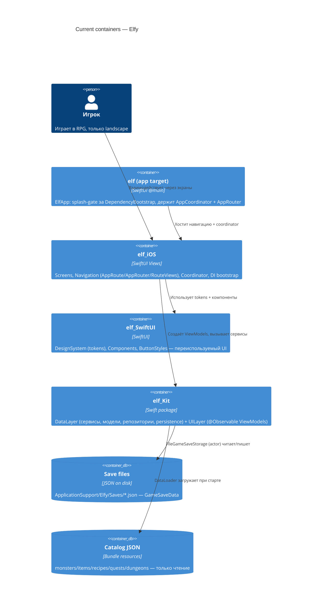

# Architecture map — Elfy (iOS RPG про эльфов)

> **Текущая** архитектура (что есть сегодня), сгенерирована `survey`; читается
> specify / design / data-model / implement. Обновлять через `survey`, когда репозиторий
> уходит дальше `reflects_commit`. Это сгенерированный файл; авторский `.claude/docs/project-architecture.md`
> — авторитетный, он согласован ниже (§Reconciliation), а не заменён.

## Stack

- **Язык / runtime:** Swift 6.0, полный Swift 6 language mode (`swiftLanguageModes: [.v6]`) — `Packages/elf_Kit/Package.swift`
- **Платформа:** iOS 18+ (`.iOS(.v18)` во всех трёх Package.swift), **только landscape**
- **UI:** SwiftUI (100%), `@Observable` + `@MainActor`, `NavigationStack`
- **Concurrency:** async/await + actors; никакого Combine
- **DI:** [swift-dependencies](https://github.com/pointfreeco/swift-dependencies) (Point-Free) 1.4.0+
- **Build:** `xcodebuild -scheme elf -destination 'platform=iOS Simulator,name=iPhone 17' build`
- **Test:** `xcodebuild test -scheme elf_Kit -destination 'platform=iOS Simulator,name=iPhone 17'`
- **Lint:** `swiftlint` (`.swiftlint.yml`)

## C4 — system as it is

## Module inventory

| Module | Path | Layers | Wired at | Responsibility |
|---|---|---|---|---|
| elf (app) | `elf/` | @main entry | `elf/ElfApp.swift` | Splash-gate за `DependencyBootstrap.run()`, держит `AppCoordinator` + `AppRouter` |
| elf_iOS | `Packages/elf_iOS/Sources/` | Screens / Navigation / Coordinator / DependencyInjection / Platform | `Packages/elf_iOS/Sources/DependencyInjection/DependencyBootstrap.swift:24` | UI-слой: экраны, роутинг, жизненный цикл сессии, save-on-background |
| elf_SwiftUI | `Packages/elf_SwiftUI/Sources/` | DesignSystem / Components / ButtonStyles / Utilities | `Packages/elf_SwiftUI/Package.swift` | Design tokens + переиспользуемые UI-примитивы; без зависимостей и тестов |
| elf_Kit | `Packages/elf_Kit/Sources/` | DataLayer (Services/Model/Repositories/Persistence/Sessions/Builders) + UILayer (ViewModels) | `Packages/elf_Kit/Package.swift` | Вся бизнес-логика + `@Observable` ViewModels (~50 сервисов) |

## Conventions (cited — the rules a new feature must match)

- **DI / registration:** каждый сервис — `{Service}+Dependency.swift` (`DependencyKey` + `DependencyValues` extension); `liveValue` = concrete impl — `Packages/elf_Kit/Sources/DataLayer/Services/Progression/Dependencies/ProgressionService+Dependency.swift`. Корни регистрируются один раз в `prepareDependencies { }` — `Packages/elf_iOS/Sources/DependencyInjection/DependencyBootstrap.swift:24`
- **MVVM-wiring:** ViewModel `@MainActor @Observable`, снимает зависимости в `init` (`@Dependency(\.x) var x`), сессионное состояние приходит через `init(session:)` — `Packages/elf_Kit/Sources/UILayer/Farm/FarmViewModel.swift:11`
- **ID-reference (phantom types):** все ID — `TypedID<Tag>` (обёртка над `UUID`), typealias-ы `MonsterID`/`ElfID`/`GameID`/… — `Packages/elf_Kit/Sources/DataLayer/Model/Shared/TypedID.swift:32`
- **Persistence / save-access:** `GameSaveData: Codable` сериализуется через actor `FileGameSaveStorage` в `ApplicationSupport/Elfy/Saves/*.json` — `Packages/elf_Kit/Sources/DataLayer/Persistence/Implementation/FileGameSaveStorage.swift`
- **Catalog / data-table loading:** `DataLoader` protocol (`loadAndDecode` с fallback + OSLog), реализации `ElfDataLoader` (Bundle) / `ProjectResourcesDataLoader` (tests) — `Packages/elf_Kit/Sources/DataLayer/Repositories/DataLoader/DataLoader.swift:11`
- **Error handling:** доменные ошибки — `Error, LocalizedError` enum с `errorDescription` на каждый case — `Packages/elf_Kit/Sources/DataLayer/Persistence/Model/GameSaveError.swift`
- **Migrations:** нет инструмента; по policy (`CLAUDE.md` §Save/Persistence) save-format миграции **не поддерживаются** в раннем деве — старые сейвы вайпаются, не мигрируются
- **Tests:** XCTest + `DependenciesTestSupport`; unit — `elf_KitTests`, тяжёлые integration — `battle_simulation_IntegrationTests` (test plans: `elf_Kit_UnitTests.xctestplan`, `battle_simulation_IntegrationTests.xctestplan`)
- **Inter-module:** строгий однонаправленный граф `elf → elf_iOS → {elf_Kit, elf_SwiftUI}`; `elf_Kit` не знает про UI, `elf_SwiftUI` без зависимостей
- **UI / styling:** только токены из `elf_SwiftUI/Sources/DesignSystem/` (никаких локальных `*Constants` в экранах) — детали в §Frontend / UI foundation

## Datastores

| Store | Engine | Accessed via | Notes |
|---|---|---|---|
| Save slots | JSON-файлы на диске | actor `FileGameSaveStorage` | `ApplicationSupport/Elfy/Saves/slot_<id>.json` + `slots.json`; модель `GameSaveData` (`.../Persistence/Model/GameSaveData.swift`) |
| Catalog (monsters/items/recipes/…) | JSON в bundle-ресурсах | `DataLoader` → `*Repository` (read-only) | Загружается при старте в `DefaultGameDataRepository`, инжектится через `prepareDependencies` |
| Runtime state | in-memory `@Observable` | `GameStore` / `GameSession` | Изменяемое игровое состояние сессии; сохраняется в save-слот |

## Frontend / UI foundation

- **Design system:** `Packages/elf_SwiftUI/Sources/DesignSystem/` — единственный источник стилей
- **Design tokens:** `ElfColors` (Text/Background/Button/Battle/Rarity…), `ElfSpacing` (xxxs→huge + семантические), `ElfSizing` (Icon/Button/ProgressBar/Cell), `ElfFonts`, `ElfCornerRadius`, `ElfShadows` (+ `.elfShadow()`), `ElfAnimations`, `ElfOpacity`
- **Styling:** нативный SwiftUI modifier-стиль; кастомные `ButtonStyles` в `Packages/elf_SwiftUI/Sources/ButtonStyles/`
- **Shared primitives:** `Packages/elf_SwiftUI/Sources/Components/`
- **Правило переиспользования:** новый экран **композирует** токены/компоненты из `elf_SwiftUI`; **запрещено** создавать локальные style-константы в `elf_iOS`
- **Closest UI precedent:** новый session-bound экран выглядит как `FarmActivityScreen` — `Packages/elf_iOS/Sources/Screens/FarmActivityScreen/FarmActivityScreen.swift:12`

## Where things live / closest precedents

- **Новый сервис/бизнес-логика** → `Packages/elf_Kit/Sources/DataLayer/Services/<Name>/` (protocol в `Dependencies/<Name>+Dependency.swift`, impl в `Implementation/`), по образцу `ProgressionService`
- **Новый экран** → VM в `Packages/elf_Kit/Sources/UILayer/<Feature>/<Feature>ViewModel.swift` + фабрика в `GameSession+ViewModelFactories.swift` + View в `Packages/elf_iOS/Sources/Screens/<Name>Screen/` + route через `SessionRouteView`; образец — Farm/Hunt
- **Боевая фича** → образец `BattleFightViewModel` + `DefaultBattleBuilder` + сервисы Battle/Combat/Damage/Dodge/Crit/BotAI
- **Данж-флоу** → образец `DungeonSession` + `DungeonViewModel` + `DungeonRouteView`
- **Presentation DTO** → `Packages/elf_Kit/Sources/UILayer/<Feature>/<Feature>DisplayModels.swift`, суффикс `*Display` (`Sendable + Equatable`)

## Constraints & known tech-debt

- **Save-миграций нет** — до первого публичного билда форма `Game`/`GameSaveData` меняется свободно, старые сейвы вайпаются (`CLAUDE.md` §Save/Persistence). `GameSaveError` содержит `unsupportedVersion`/`migrationFailed` cases «на вырост», но версионирование сейвов отложено до pre-ship.
- **Только landscape** — весь UI обязан работать в горизонтальной ориентации.
- **Запрет `static`** — константы/сервисы через DI, не `static` (`CLAUDE.md` §Code Rules); нарушение — code smell.
- **Тяжёлые integration-тесты** — `battle_simulation_IntegrationTests` (~360k боёв, ~2.5 мин); не гонять в быстром цикле — только unit `elf_Kit` для итераций.
- **Swift 6 strict concurrency** включён — новый код обязан быть `Sendable`-корректным без `@unchecked`.

## Reconciliation with the authored architecture doc

Авторский `.claude/docs/project-architecture.md` — авторитетный источник паттернов и **согласуется** с кодом по MVVM-слоям, DI-стилю, Screen-паттерну, Presentation-типам и Design System. Ранее отмеченный дрейф именования `GameSessionModel` → **`GameSession`** (`Packages/elf_Kit/Sources/DataLayer/Sessions/GameSession.swift:24`, фабрики в extension `.../UILayer/GameSession/GameSession+ViewModelFactories.swift`) **устранён** в авторском doc (commit `8e97e95`).

Расхождений с авторским документом не выявлено.
