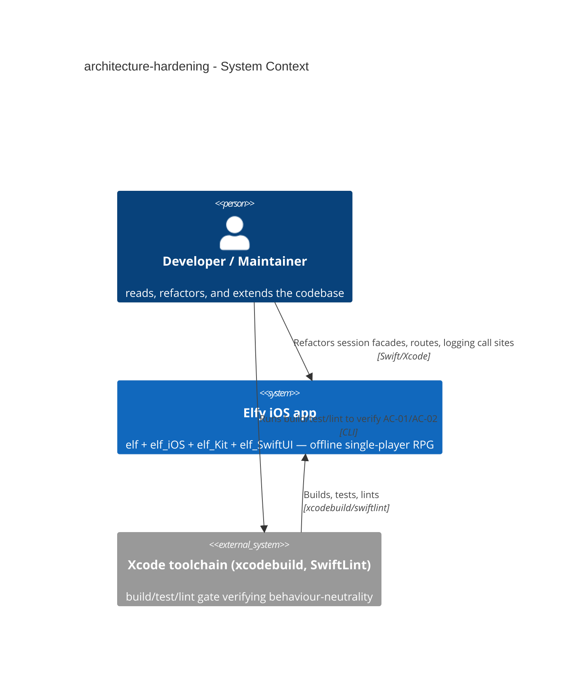
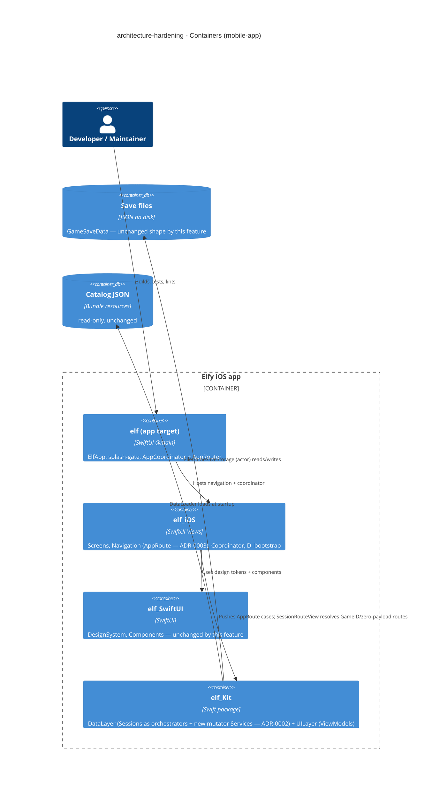
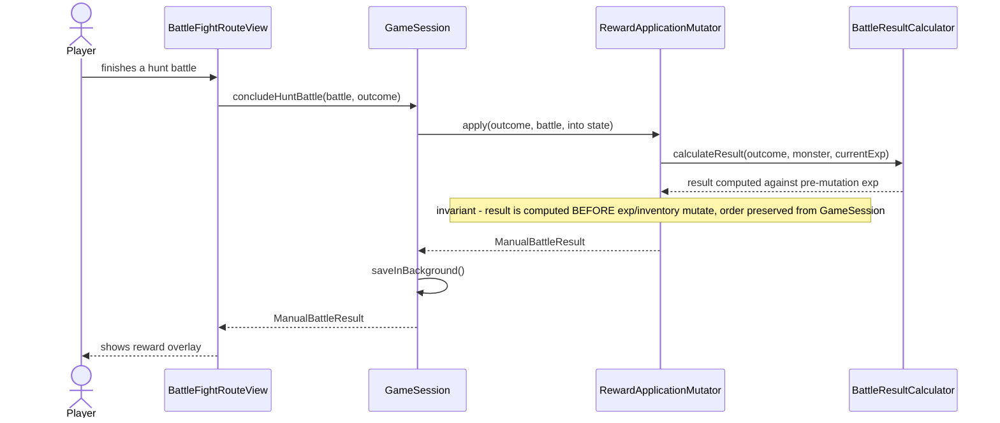
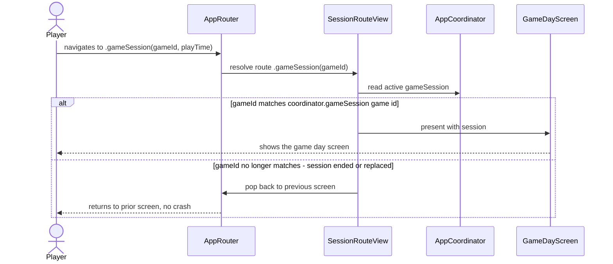
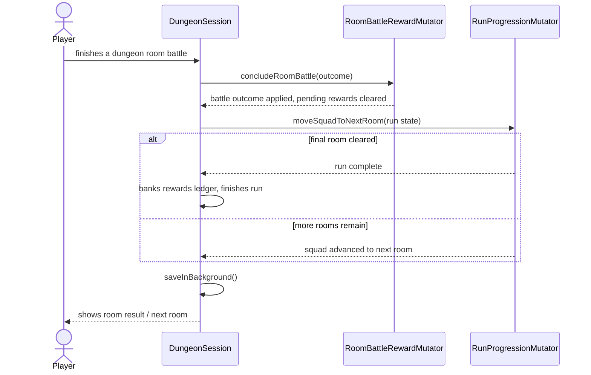
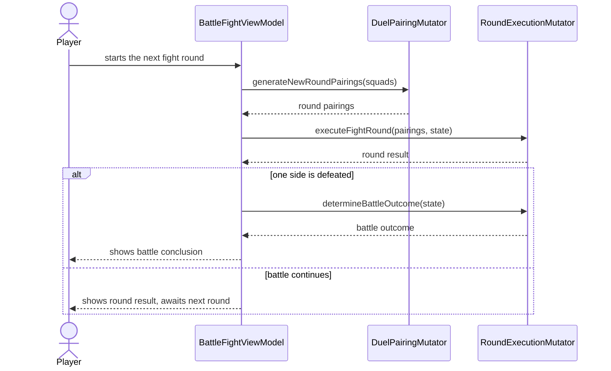
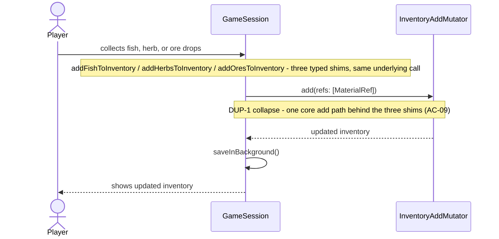

# Software Architecture Document — architecture-hardening

<!-- 12 Arc42 sections. Empty section → <!-- N/A: <reason> -->. -->
<!-- C4 Context (L1) lives inline in §3. C4 Container (L2) lives inline in §5. -->
<!-- Numbers in §10 come VERBATIM from spec.md §6 NFR — no inventing, no rounding. -->

## 1. Introduction and goals

<!-- 🎯 Why: durable memory of «what + the three dominant qualities + who cares». A year from
     now nobody recalls which three qualities were critical for this system.
     📋 Write: 1 ¶ intent + 3 lines of top-3 quality goals + a stakeholders table.
     ¶4 is the override slot — critic `Override` resolutions emit «Decision override: <headline>
     — rationale: <reason>» bullets here so downstream skills see the deliberate choice. -->

**Intent.** Elfy's codebase is strong but uneven: outstanding patterns (invariant-bearing value types, auto-composing DI, project-wide typed IDs) sit next to a lagging floor — a session god-object (`GameSession`, 251→564 LOC after one feature bolt-on), a second god-object (`DungeonSession`, 365 LOC) and the largest ViewModel (`BattleFightViewModel`, 422 LOC); navigation routes carrying whole domain models behind ~72 hand-written equality lines; ViewModel/service logging that bypasses the project's own logger abstraction via raw `print` (9 confirmed sites across 4 files, re-verified 2026-07-09 — see §11); and three near-duplicate inventory-add methods. This feature raises the floor to the ceiling through a strictly behaviour-neutral consistency-and-surgery bundle — no new SPM module, no feature rewrite — for the sole beneficiary: the Developer/Maintainer who has to find, read, and safely extend this code.

**Top-3 quality goals (1-liners; full scenarios in §10):**

1. **Consistency** — the weakest areas (logging discipline, session/VM size, navigation state) match the codebase's strongest patterns.
2. **Self-defending consistency** — a mechanical lint guard prevents the logging regression from silently returning.
3. **Behaviour neutrality** — the game and its existing test suite behave identically before and after every refactor.

**Stakeholders.**

| Role | Interest | Sign-off owner? |
|---|---|---|
| Developer / Maintainer (Vitalii Lytvynov) | Authors, reads, and extends this code daily — the sole beneficiary of a raised floor | No |
| Tech Lead (Vitalii Lytvynov, same person) | SAD approval | Yes |

<!-- Decision overrides (¶4) — populated by the critic resolution loop, empty otherwise. -->

## 2. Constraints

<!-- 🎯 Why: §4 strategy only works when §2 has fixed WHAT IS ALREADY FIXED — stack, versions,
     deadline, regulatory. This is an input, not an output.
     📋 Write: four blocks — Technical / Organisational / Conventions / Regulatory.
     📌 Pin versions («<datastore> 18», not «<datastore>»); «Q3 deadline — hard», not «ideally».
     Never N/A — every feature inherits at least Conventions + Technical. -->

**Technical.**
- Swift 6.0, full Swift 6 language mode (`swiftLanguageModes: [.v6]`) — `Packages/elf_Kit/Package.swift`
- iOS 18+ (`.iOS(.v18)` across all three `Package.swift`), **landscape-only**
- SwiftUI 100% — `@Observable` + `@MainActor`, `NavigationStack`
- async/await + actors — no Combine
- [swift-dependencies](https://github.com/pointfreeco/swift-dependencies) (Point-Free) 1.4.0+
- Architecture convention: strict one-directional module graph `elf → elf_iOS → {elf_Kit, elf_SwiftUI}`; `elf_Kit` UI-agnostic, `elf_SwiftUI` has zero dependencies

**Organisational.**
- No hard deadline — early active development; effort not sprint-boxed
- Solo developer (Vitalii Lytvynov) — no team coordination overhead
- Consequence for scope: §4/§5 may target the full delegation reshape of all three god-objects in one pass rather than an incremental multi-PR rollout, since there is no time pressure forcing a partial cut

**Conventions.**
- `CLAUDE.md` (Code Rules: no `static`; Save/Persistence Policy — no save-format migrations pre-ship) + `.claude/docs/{project-architecture,dependency-injection,persistence-patterns,model-organization,type-driven-design}.md`
- ID strategy: `TypedID<Tag>` phantom types — `Packages/elf_Kit/Sources/DataLayer/Model/Shared/TypedID.swift`
- DI pattern: `{Service}+Dependency.swift` (`DependencyKey` + `liveValue` = concrete impl), roots registered once in `prepareDependencies { }` — `Packages/elf_iOS/Sources/DependencyInjection/DependencyBootstrap.swift:24`
- Error handling: domain `Error, LocalizedError` enums with an `errorDescription` per case — `Packages/elf_Kit/Sources/DataLayer/Persistence/Model/GameSaveError.swift`

**Regulatory / external.**
- N/A — offline single-user game; no PII, no network surface, no auth boundary (spec §6.1).
- Save-migration policy (CLAUDE.md §Save/Persistence): no migrations while pre-ship — `Game`/`GameSaveData` shape changes freely, dev saves are wiped between runs. This removes migration risk from the mutator-extraction work: internal session state can be reshaped without save-format versioning.

## 3. Context and scope

<!-- 🎯 Why: draws the SYSTEM BOUNDARY — who talks to it from outside, where the trust zone ends.
     Without §3, §5 and §8 (authorization) blur — unclear what's «inside» vs «outside».
     📋 Write: 2–3 sentences of business context + an external-systems table + a C4Context block.
     📌 «External: none (deliberate, no third-party in v1)» is itself a decision worth stating.
     Trust boundary — the line past which you don't trust data without checking it.
     Never N/A — greenfield still draws the planned actors + external systems. -->

Elfy is a solo-developed offline iOS RPG. This feature touches no player-facing surface — its business context is entirely internal: the Developer/Maintainer's ability to safely read, extend, and reason about the codebase. The system boundary does not change: the app remains a single offline deployable with no new external dependency. The Player is not an actor of this feature — gameplay behaviour is preserved unchanged (AC-01); the player experiences no observable difference.

<!-- brownfield: docs/architecture-map.md (reflects_commit 03562c3, fresh — matches current HEAD) — 4-module layered graph elf → elf_iOS → {elf_Kit, elf_SwiftUI}, no cycles -->

**External systems (in / out):**

| Actor or system | Type | Interaction |
|---|---|---|
| Developer / Maintainer | Person | Refactors session facades, navigation routes, logging call sites |
| Xcode toolchain (`xcodebuild`, `SwiftLint`) | System (external, local) | Build/test/lint gate that verifies AC-01/AC-02 (behaviour-neutrality + the new logging rule) |

**External: deliberately none beyond the local toolchain** — an offline single-player game with no network, no backend, no identity provider; the feature lives entirely inside the one existing system.

**C4 Context (L1):** <!-- syntax → references/c4-mermaid-syntax.md. Real names, no <placeholder> stubs. -->



## 4. Solution strategy

<!-- 🎯 Why: the 3–4 STRATEGIC PILLARS every ADR grows from. Without §4 each ADR looks random —
     there's no umbrella. ⭐ The densest section — the blast-radius gate fires almost always here
     (decisions are irreversible + multi-module).
     📋 Write: 3–4 choices; each a heading + 2–3 sentences of rationale.
     📌 «Store content as a table of typed blocks» is a pillar — ADR-0001 grows from it. -->

**Target surface.** `mobile-app` — the existing native iOS app (`elf` + `elf_iOS` + `elf_Kit` + `elf_SwiftUI`). This is a refactor inside an already-shipping surface; no new surface is introduced. **UI-architecture follow-on:** native SwiftUI — already the project's fixed choice (CLAUDE.md), not a decision this feature makes; no legitimate alternative exists in scope, so this stays inline, no ADR.

**Top strategic choices (the seeds for ADRs):**

1. **Surgical refactor inside the existing four modules, no new SPM feature-module** ([[adr/0001-surgical-refactor-within-existing-modules.md|ADR-0001]]) — both `architecture-review.md` and `architecture-review-summary.md` independently diagnose the pain as 3–4 god-objects and flat buckets, not a missing module boundary; none of the standard modularization triggers (build-friction, deploy cascade, a second developer) have fired. All work stays inside `elf_Kit`/`elf_iOS`.
2. **Facade → orchestrator via DI-injected, domain-rule-family mutators** ([[adr/0002-facade-orchestrator-mutator-injection.md|ADR-0002]]) — `GameSession`, `DungeonSession`, and `BattleFightViewModel` stop implementing domain rules inline; each **domain-*mutation*** MARK group becomes its own injected, independently-unit-tested type via the project's existing `{Service}+Dependency.swift` DI triad — concretely 7 of `GameSession`'s 10 MARK groups (Equipment/Crafting/Persistence stay inline — they already thinly delegate to `EquipmentService`/`CraftService` and are session-lifecycle, not domain rules), 2 of `DungeonSession`'s 3 (Persistence stays inline), and 3 of `BattleFightViewModel`'s 4 (Player Actions/Data Loading stay inline — UI-state toggling, not a domain rule) — 12 new mutator types total (see §5 for the concrete list). Pure display/formatting logic stays as a `+Display.swift` extension (the already-proven `InventoryViewModel+DisplayItems.swift` pattern) — extension files are fine for derivation, never for domain mutation (AC-06).
3. **`AppRoute.gameSession`/`.calendar` → ID/zero-payload with destination-side resolution + silent pop-back on mismatch** ([[adr/0003-approute-id-payload-with-destination-resolution.md|ADR-0003]]) — `.gameSession(Game, playTime:)` → `.gameSession(GameID, playTime:)`; `.calendar([GameDay], currentDayNumber:)` → zero-payload `.calendar`, resolved via the already-established `SessionRouteView { Screen(session: $0) }` precedent used by `.hunt`/`.farm`/`.craft`/`.questList`. A new destination-side guard compares the route's `GameID` against the active session and silently pops back on mismatch — a real gap today (the current `.gameSession` view construction ignores its payload entirely).
4. **Mechanical logging guard: a custom SwiftLint rule + explicit path allow-list** ([[adr/0004-swiftlint-rule-for-raw-print.md|ADR-0004]]) — enforced via `custom_rules` in the existing `.swiftlint.yml` (no new tool), scoped by an allow-list covering logger implementations, the dependency-free `elf_SwiftUI` leaf module, dev-only tooling, diagnostics, and the pre-bootstrap `elf/ElfApp.swift`. Re-verified 2026-07-09: 9 confirmed violations + 1 borderline (`AppCoordinator.swift`) across `GameSession`, `CharacterCreationViewModel`, `GameDayViewModel`, `DefaultDungeonRewardCalculator`.

Each tactical decision in later sections should trace to one of these seeds. Tactical decisions that *contradict* a strategic choice are red flags — surface them in §11.

## 5. Building block view

<!-- 🎯 Why: INTERNAL DECOMPOSITION — modules, containers, datastores. The static topology: who
     may talk to whom. Without §5, §6 (the flows) has no vocabulary of participants.
     📋 Write: 1 ¶ on the style (layered / hexagonal / clean / event-driven) + a folder tree + a
     C4Container block.
     📌 Draw ONE Container per declared `target_surface` (frontmatter): a fullstack
     [backend-service, web-frontend] = a backend-API container + a web/SPA container; a
     [backend-service, mobile-app] = the API + the mobile app. The Container(web, …) line below is
     just one surface's container — swap/add per what was declared in §4. → _shared/surfaces.md
     📌 e.g. «web app, content API, media worker, datastore, object store, CDN». -->

Elfy already follows a layered MVVM architecture with a DI-composed service layer (protocol + `Implementation/` + `{Service}+Dependency.swift` triad, per `dependency-injection.md`). This feature extends that same layering **one tier deeper**, not sideways: instead of a session facade implementing domain rules inline, it adds a `DataLayer/Services/<FamilyName>/` entry per domain-rule family — the same triad shape as every existing service (`ProgressionService`, `EquipmentService`, `CraftService`) — sitting between the facade (pure orchestration) and the domain models. No new architectural style (no hexagonal ports, no event bus) — this is the codebase's own established pattern applied where it was previously skipped ([[adr/0002-facade-orchestrator-mutator-injection.md|ADR-0002]]).

**Internal decomposition** (new types only; existing services/files are unlisted):

```
Packages/elf_Kit/Sources/DataLayer/Services/
├── DayCycle/{DayCycleMutator.swift, Implementation/, Dependencies/}                  (NEW — advanceToNextDay, AP reset, buff expiry)
├── RewardApplication/{…}                                                            (NEW — concludeHuntBattle; AC-04 invariant #1)
├── RosterProgression/{…}                                                            (NEW — addExperience/addDrops "any elf")
├── InventoryAdd/{…}                                                                 (NEW — collapses DUP-1: one add(_ refs: [MaterialRef]))
├── BuffApplication/{…}                                                              (NEW — applyGlobalBuffToPlayer/applyGlobalBuff)
├── WorldTurn/{…}                                                                    (NEW — applyWorldTurn; AC-04 invariant #2)
├── DungeonLifecycle/{…}                                                             (NEW — start/release/flush/bank/finish/discard dungeon run)
├── RunProgression/{…}                                                               (NEW — DungeonSession.beginRun/restoreQuarter/apply/moveSquadToNextRoom)
├── RoomBattleReward/{…}                                                             (NEW — DungeonSession.concludeRoomBattle/applyBattleOutcome/clearPendingRewards)
├── BattleBuff/{…}                                                                   (NEW — BattleFightViewModel.applyBattleBuff/rescaleCurrentVitals)
├── RoundExecution/{…}                                                               (NEW — executeFightRound/executeWatchUntilEnd/runRound/determineBattleOutcome)
├── DuelPairing/{…}                                                                  (NEW — generateNewRoundPairings)
├── Progression/, Equipment/, Craft/, …                                              (existing — untouched; already thin orchestration)

Packages/elf_Kit/Sources/DataLayer/Sessions/
├── GameSession.swift              (564→~300 LOC target: orchestrates via 7 injected mutators, keeps Equipment/Crafting/Persistence inline)
├── DungeonSession.swift           (365→~250 LOC target: orchestrates via 2 injected mutators)

Packages/elf_Kit/Sources/UILayer/BattleFight/
├── BattleFightViewModel.swift             (422→~250 LOC target: orchestrates via 3 injected mutators, keeps Player Actions/Data Loading inline)
├── BattleFightViewModel+Display.swift     (NEW — pure view-state/formatting extension, the InventoryViewModel+DisplayItems precedent)

Packages/elf_iOS/Sources/Navigation/
├── AppRoute.swift                  (`.gameSession`/`.calendar` → ID/zero-payload; ADR-0003)
```

**C4 Container (L2):** <!-- syntax → references/c4-mermaid-syntax.md. Real names, no <placeholder> stubs. ONE Container per declared target_surface (frontmatter); mobile-app = the existing 4-module decomposition, unchanged — this feature reorganizes *within* elf_Kit, it introduces no new container. -->



## 6. Runtime view

<!-- 🎯 Why: the RUNTIME FLOW of 1–2 critical scenarios — who talks to whom, when, in what order.
     Without §6, §5 is just boxes with no life.
     📋 Write: a Mermaid sequenceDiagram. Participants are names from §5 (don't invent new ones).
     Messages are semantic («saves a draft»), NO HTTP verbs / paths / status codes — endpoint-level
     sequences arrive at the `api` stage.
     📌 e.g. «author → web: composes draft → web → content API: save». Seed the primary flow(s) here;
     the `sequences` stage then covers every §5 AC (no cap). Never N/A for M+; XS/S keeps ≥1 happy-path flow. -->

**Critical flow 1: Hunt-battle reward application (the AC-04 invariant #1 flow)**



**Critical flow 2: Navigation resolution with GameID mismatch fallback (the AC-05 flow)**



**Critical flow 4: Dungeon room-battle conclusion and run progression (US-01/US-05, DungeonSession delegation)**



**Critical flow 5: Battle round execution (US-01/US-05, BattleFightViewModel delegation)**



**Critical flow 6: Inventory-add collapse (the AC-09 / DUP-1 flow)**



## 7. Deployment view

<!-- 🎯 Why: the TOPOLOGY DevOps must know without reading the deploy charts — how many replicas,
     where the background worker lives, AT WHAT NUMBERS we scale.
     📋 Write: 2–3 sentences on topology + monitoring + concrete threshold numbers.
     📌 e.g. «500 authors → partition by quarter» (not «we'll think about scale later»).
     🎯 N/A allowed for XS/S that reuses an existing deployment unit with no change.
     Deployment-diagram scaffold → templates/deployment.md. -->

<!-- N/A: reuses the existing deployment unit — a single iOS app target (elf.xcodeproj) shipping via App Store/TestFlight; no server component, no new deployment unit, no infra change from this refactor. -->

## 8. Crosscutting concepts

<!-- 🎯 Why: CROSS-CUTTING PATTERNS spanning several modules: logging, errors, authorization, ID
     strategy, events, caching. ⭐ The second-densest section. A pattern inside one module is NOT
     here; a project-wide convention belongs in the convention file.
     📋 Write: a table — concept / convention / where defined. One row per concept.
     📌 e.g. «sortable time-based IDs generated in the app layer» as a default from the convention file. -->

| Concept | Convention | Where defined |
|---|---|---|
| Logging | ViewModels/services route through `@Dependency(\.debugGameLogger)` / `\.debugBattleLogger`; raw `print` banned outside an explicit allow-list, enforced mechanically by a SwiftLint `custom_rules` entry | [[adr/0004-swiftlint-rule-for-raw-print.md\|ADR-0004]] |
| Authentication | N/A — offline single-user game, no auth boundary | spec §6.1 |
| Error handling | Domain `Error, LocalizedError` enums, one case per failure with `errorDescription` | `GameSaveError.swift` precedent — unchanged by this feature |
| ID strategy | `TypedID<Tag>` phantom types; `AppRoute.gameSession` now carries `GameID` instead of `Game` | `TypedID.swift`; [[adr/0003-approute-id-payload-with-destination-resolution.md\|ADR-0003]] |
| Internationalisation | N/A, single language | — |
| Observability | Only the existing debug loggers (`Console*` implementations); no tracing/metrics — a local single-user app | — |
| Events | N/A — no event bus; DI-injected mutators are synchronous delegating calls, not events | [[adr/0002-facade-orchestrator-mutator-injection.md\|ADR-0002]] |
| Access control | Session/game state stays module-gated — public read-only (`private(set)`), mutation only via facade methods inside `elf_Kit` (AC-03); the new mutator types live inside `elf_Kit` too, so this invariant is unaffected by the extraction | existing convention, unchanged |

**Logging allow-list (the exact scope for ADR-0004's SwiftLint `custom_rules` — implement wires these as `included`/`excluded` globs):**

| Path | Why allow-listed |
|---|---|
| `**/Services/Logging/Implementation/*Logger*.swift` | The logger implementations themselves (`ConsoleDebugGameLogger`, `ConsoleDebugBattleLogger`) — they must call `print` to do their job |
| `Packages/elf_SwiftUI/**` | Leaf design-system module — zero dependencies by design, cannot inject a logger |
| `Packages/elf_iOS/Sources/Screens/Dev/**`, `Packages/elf_Kit/Sources/UILayer/Dev/**` | Dev-only tooling (e.g. `MultiBattleViewModel` intentionally dumps balance-sweep stats to console for manual tuning) |
| `Packages/elf_iOS/Sources/Diagnostics/**` | Diagnostics tooling (`FPSCounter`) |
| `elf/ElfApp.swift` | Prints happen before `DependencyBootstrap.run()` completes — no DI container wired yet |

Two persistence-layer print sites (`FileGameSaveStorage.swift`'s private `debugLog` helper, `DungeonRunRewardsSaveData.swift`'s orphaned-reference warnings) do **not** fit any allow-list category and are **not** pre-approved by this SAD — see §11 for the open disposition (fix vs. extend the allow-list, deferred to `tasks`).

## 9. Architecture decisions

<!-- 🎯 Why: the REVERSE INDEX onto the adr/ folder. `ls adr/` gives the files; §9 gives the
     semantics — why they exist, which SAD section they attach to, what status.
     📋 Write: a 4-column table, one row per ADR. Mixed status is fine.
     📌 e.g. «0001 | Store content as a table of typed blocks | Accepted | §4». -->

| # | Title | Status | Section |
|---|---|---|---|
| 0001 | Keep the surgical refactor inside the existing four modules, no new SPM feature-module | Accepted | §4 |
| 0002 | Reshape session facades and the largest ViewModel into orchestrators over DI-injected, domain-rule-family mutators | Accepted | §4, §5 |
| 0003 | Convert AppRoute.gameSession and .calendar to ID/zero-payload with destination-side resolution and silent pop-back on mismatch | Accepted | §4, §6 |
| 0004 | Enforce the logger-not-print rule with a custom SwiftLint rule and an explicit path allow-list | Accepted | §4, §8 |

ADR files live under `docs/features/architecture-hardening/adr/NNNN-<title>.md`.

## 10. Quality requirements

<!-- 🎯 Why: the QUALITY TREE — take a goal from §1 and break it into concrete leaves: tests,
     metrics, configs, drills. ⭐ Without §10, §1 is a manifesto. With §10 each declaration maps
     to something PROVABLE.
     📋 Write: per §1 goal — When / Then / How-verify. Numbers from spec §6 NFR VERBATIM (don't
     round ≤250ms to ≤300ms — that's a critic F6 hit).
     📌 e.g. «p95 ≤ 500 ms on a block update, verified by a 100 req/s load test». -->

Each top-3 goal from §1 expanded into a full scenario:

**QG-1. Consistency**
- **When:** the logging, session/ViewModel-delegation, and navigation refactors are complete.
- **Then:** raw `print` sites in ViewModels/services drop from **9 confirmed** (re-verified 2026-07-09: `GameSession`×1, `CharacterCreationViewModel`×4, `GameDayViewModel`×3, `DefaultDungeonRewardCalculator`×1) to **0** outside the §8 allow-list; `GameSession`/`DungeonSession`/`BattleFightViewModel` delegate every identified domain-rule family (§5) to an injected, independently-unit-tested mutator — AC-06's checkable delegation rule is the hard gate, the ≤300 LOC target (spec §6 NFR) is advisory only; `AppRoute`'s hand-written `Equatable`/`Hashable` shrinks by the `.gameSession`/`.calendar` cases (of the current 72 lines across all 8 cases).
- **How verify:** `swiftlint --strict` (0 violations) + a `print(` grep restricted to non-allow-listed paths (= 0 matches) + a manual AC-06 check per mutator (separate injected type + its own unit test + facade reduced to one delegating call, not an extension) + reading the `AppRoute.swift` diff to confirm `.gameSession`/`.calendar` synthesize `Hashable`. AC-08 (two identified doc fixes — the stale `DefaultGameService` comment in `GameStore.swift`, the platform line in `CLAUDE.md`) is a mechanical correction, not an architectural decision — it carries no §5 building-block and is verified simply by reading the diff at `tasks`/`implement`, not by a dedicated architectural mechanism.

**QG-2. Self-defending consistency**
- **When:** a future change (including one made by the Developer/Maintainer later) introduces a raw `print(` in a ViewModel or service outside the §8 allow-list.
- **Then:** the SwiftLint `custom_rules` gate from [[adr/0004-swiftlint-rule-for-raw-print.md|ADR-0004]] blocks it and explains, in plain language, that logging must go through the logger dependency instead of a raw print (AC-02) — the block is visible in the IDE, not only at CI time.
- **How verify:** insert a deliberate `print(` into a non-allow-listed file (e.g. `GameDayViewModel.swift`) and confirm `swiftlint` fails with the rule's message; remove it after confirming.

**QG-3. Behaviour neutrality**
- **When:** all in-scope structural changes (§4/§5) are complete.
- **Then:** the build compiles with **0 build errors, 0 new warnings**; **100% of existing unit tests pass unchanged** — re-verified 2026-07-09 at **420** test functions in `elf_KitTests` (revises spec §7's stale ~398 baseline; target is **≥420**, not ≥398); lint is clean (`swiftlint --strict`, 0 violations, including the new logging rule) — together, AC-01; the two AC-04 invariants (the reward-application "compute before mutate" ordering in `RewardApplicationMutator`/`RoomBattleRewardMutator`, and the world-turn roster-reshuffle guard in `WorldTurnMutator`) each have a dedicated named regression test written **before** their mutator is extracted; `battle_simulation_IntegrationTests` duration stays within **±5%** of the pre-change baseline captured before the first refactor PR (spec §6 NFR).
- **How verify:** `xcodebuild test -scheme elf_Kit -destination 'platform=iOS Simulator,name=iPhone 17'` (0 failures, ≥420 passing) + `xcodebuild -scheme elf -destination 'platform=iOS Simulator,name=iPhone 17' build` (0 errors, 0 new warnings) + `swiftlint --strict` (0 violations) + `battle_simulation_IntegrationTests` duration recorded pre-change and diffed post-change (±5%).

## 11. Risks and technical debt

<!-- 🎯 Why: ⭐ collects EVERYTHING that can break — not only the technical. Without §11 risks get
     discussed at standups and lost; debt lives only in the head of whoever accepted it.
     📋 Write: a risk/debt table — severity — mitigation — owner. Accepted debt in its own block.
     📌 The first risk is often a product risk, not a technical one. That's normal. -->

<!-- Severity literals: Low / Medium / High for regular risks; "Open question" for rows created by
     a Save-as-OQ resolution during the Socratic walk (see references/socratic.md). -->

| Risk / debt | Severity | Mitigation | Owner |
|---|---|---|---|
| Two persistence-layer `print` sites (`FileGameSaveStorage.swift`'s `debugLog` helper, `DungeonRunRewardsSaveData.swift`'s orphaned-reference warnings) fit no §8 allow-list category — the new SwiftLint rule will flag them | Medium | `tasks` decides per-site: extend the allow-list (persistence-layer diagnostic path) or route through the logger — resolve before the logging-rule task closes | Vitalii Lytvynov |
| `AppCoordinator.swift:101`'s raw print is a borderline case — a Coordinator, not literally a "ViewModel or service" per AC-02's wording, but has a logger dependency reachable | Low | `tasks` makes an explicit in/out-of-scope call for this one site and records the rationale | Vitalii Lytvynov |
| The runtime-performance NFR (±5% vs. baseline) has nothing to compare against unless the baseline is captured **before** the first refactor PR merges (spec §6 NFR's own baseline-capture step) | Medium | First task in `tasks.json` runs `battle_simulation_IntegrationTests` on the pre-change commit and records the duration | Vitalii Lytvynov |
| AC-04's two invariant regression tests (reward-application ordering, world-turn roster-reshuffle guard) must be written **before** their mutator is extracted (TDD red-first) — writing them after the extraction would validate the new code against itself, not against the preserved invariant | Medium | `tasks`/`implement` order each mutator's task so the invariant test is the task's RED step, not a follow-up | Vitalii Lytvynov |
| §6's runtime view has no drawn sequence flow for AC-04 invariant #2 (the world-turn roster-reshuffle guard in `WorldTurnMutator`) — deferred during `sequences` (2026-07-09) pending confirmation of the mutator's exact per-elf iteration/guard shape against current `GameSession.applyWorldTurn` code, rather than guessing it | Open question | Draw and confirm the missing `sequences` flow (or an explicit non-runtime N/A) before/while extracting `WorldTurnMutator` at `implement`; the invariant itself is still gated by AC-04/QG-3's named regression test regardless of whether a diagram exists | Vitalii Lytvynov |

**Accepted debt (acceptable now, plan to fix later):**
- **M-1** — `Game` identifies the player by `playerHouseIndex`/`playerMemberIndex` (array position, not ID); out of scope per spec §3 non-goals — risky to change, low priority while house/member layout stays fixed.
- **E-1** — silent save failures (`try?` + `print` under `#if DEBUG`) are deferred to their own feature per spec §3 non-goals; the real save path is a coalesced background task with no synchronous owner to attach a user-facing error contract to yet.
- **TEST-1** — 23 `@Observable` ViewModels, 1 pre-existing test file (`BattleFightViewModelTests`); this feature closes part of the gap opportunistically (ADR-0002 adds ≥12 new mutator unit tests), but the remaining ViewModels stay untested — ongoing, not resolved here.
- The battle routes (`.battleFight`/`.autoBattleResult`/`.multiBattleResult`, carrying `Battle`) keep their hand-written `Equatable`/`Hashable` — out of scope per spec §3 non-goals (no battle-route ID migration / battle store in this feature); a future feature inherits this debt.
- SwiftLint `custom_rules` regex matching (ADR-0004) can be defeated by reformatting (e.g. `Swift.print(`) — accepted limitation of textual lint rules; closing it fully would need a SwiftSyntax-based custom lint plugin, out of this feature's effort budget.

## 12. Glossary

<!-- 🎯 Why: ⭐ the DOMAIN GLOSSARY that ends arguments a year later («checkpoint — weekly or
     biweekly? quarter — calendar or fiscal?»).
     📋 Write: a term / meaning table. Business + technical terms mixed.
     📌 e.g. «Lesson | a unit inside a course made of blocks (text, video)». -->

| Term | Meaning |
|---|---|
| God-object | A type that keeps growing without bound because new features add methods to it directly instead of delegating to a smaller, focused type — this feature's diagnosis for `GameSession`, `DungeonSession`, `BattleFightViewModel`. |
| Facade-orchestrator | The target shape for the three god-objects: a single, small entry point that *delegates* domain rules to injected mutators rather than *implementing* them inline (US-05). |
| Mutator | An injected, independently-unit-tested type that owns one domain-rule family's mutation logic, following the project's `{Service}+Dependency.swift` DI triad — this feature's term for AC-06's "separate injected type" requirement ([[adr/0002-facade-orchestrator-mutator-injection.md\|ADR-0002]]). |
| Domain-rule family | A `// MARK:`-grouped cluster of related mutation methods on a facade (e.g. "World Turn", "Battle conclusion") that becomes one mutator when extracted — grounded against the current code's real MARK groups, not invented. |
| Reward-application invariant (AC-04 #1) | "Compute the result against the current values *before* the mutation runs" — e.g. `concludeHuntBattle` computes XP/drops against pre-mutation state before applying them; violating the order corrupts the result overlay's before→after progression. |
| World-turn roster-reshuffle guard (AC-04 #2) | `applyWorldTurn` verifies each target elf's `id` still matches the expected roster slot before mutating, guarding against the party roster changing mid world-turn resolution. |
| `SessionRouteView` | The existing `elf_iOS` adapter that resolves the active `GameSession` from `AppCoordinator` for session-bound screens (`.hunt`/`.farm`/`.craft`/`.questList` today; `.gameSession`/`.calendar` after [[adr/0003-approute-id-payload-with-destination-resolution.md\|ADR-0003]]). |
| `DUP-1` | The architecture-review finding ID for the three near-duplicate `addFishToInventory`/`addHerbsToInventory`/`addOresToInventory` methods on `GameSession`, collapsed by the `InventoryAddMutator` (AC-09). |
| `TypedID<Tag>` | The project's phantom-typed ID wrapper over `UUID` (e.g. `GameID`) — prevents mixing up different ID kinds at compile time; unrelated to this feature but referenced by ADR-0003's route conversion. |
