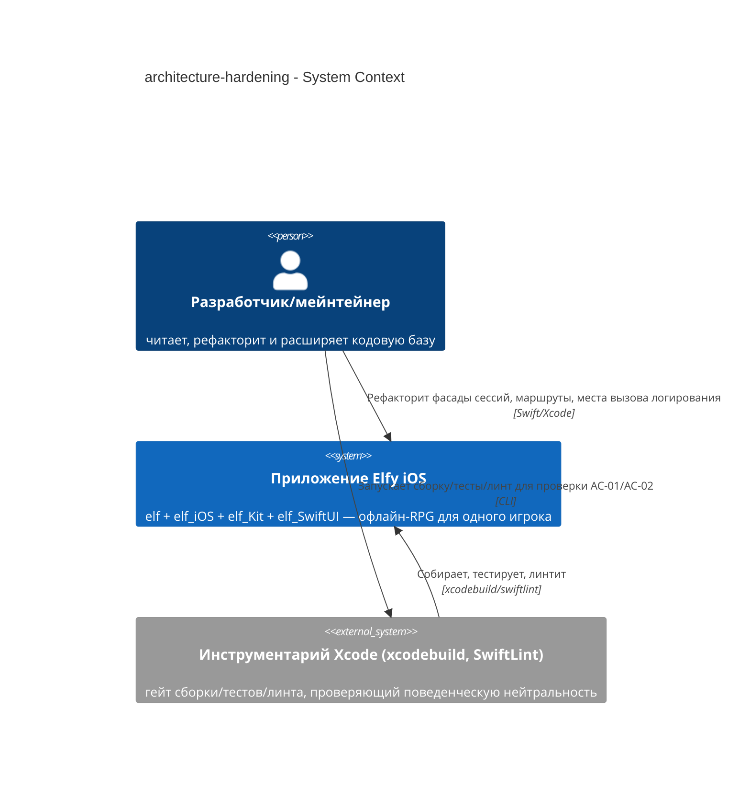
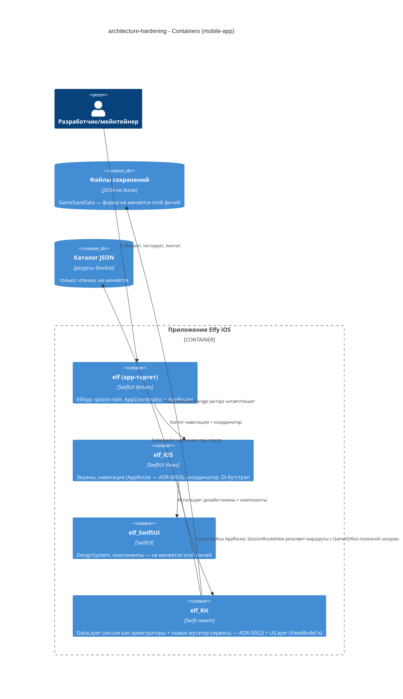
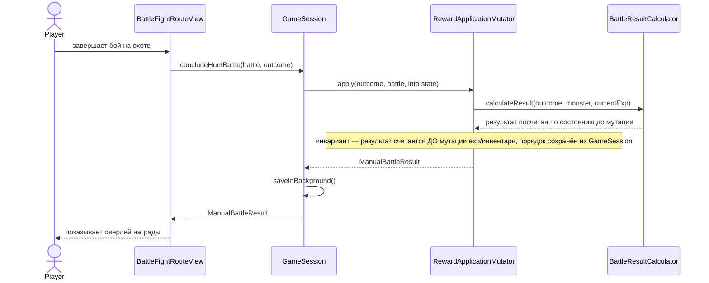
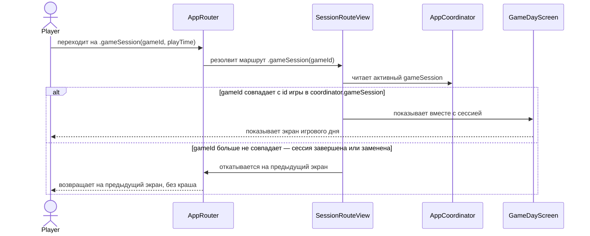
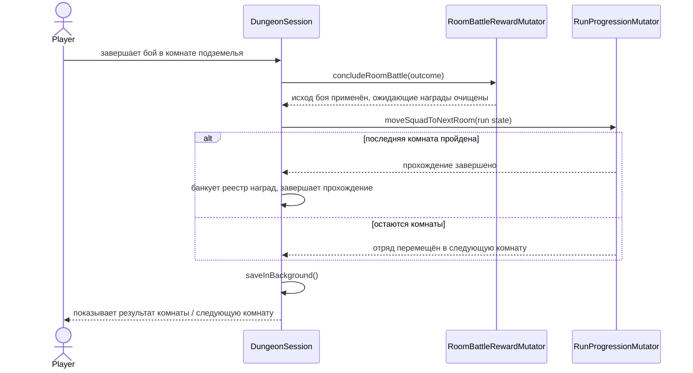
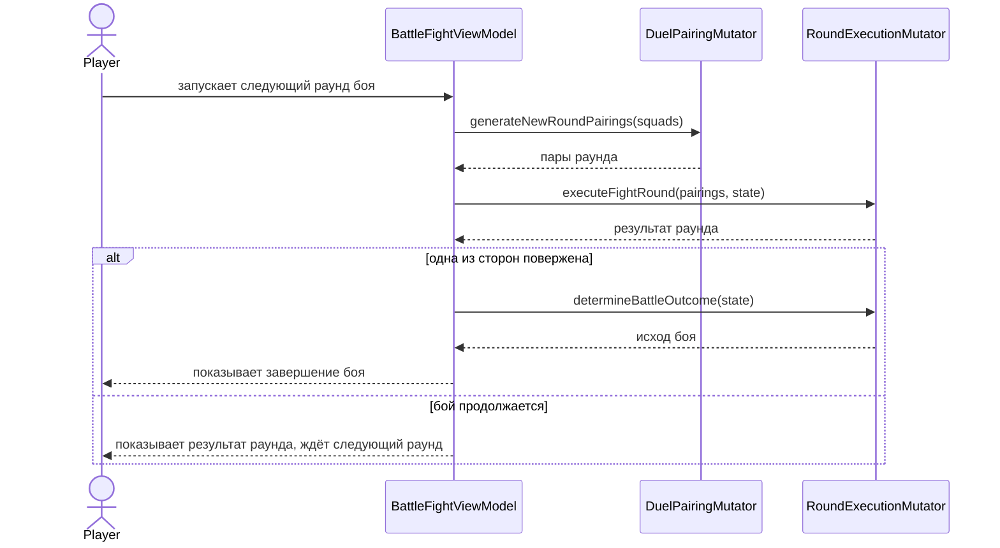
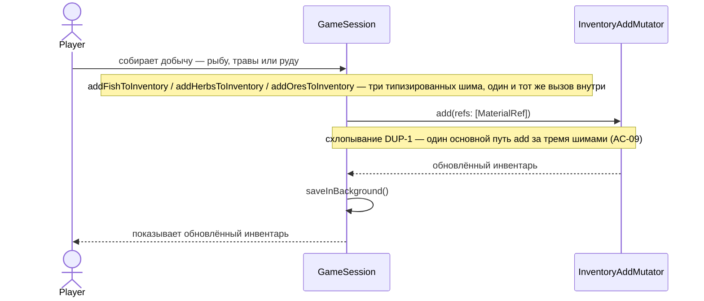

# Документ архитектуры программного обеспечения — architecture-hardening

<!-- 12 разделов Arc42. Пустой раздел → <!-- N/A: <причина> -->. -->
<!-- C4 Context (L1) находится внутри §3. C4 Container (L2) находится внутри §5. -->
<!-- Цифры в §10 берутся ДОСЛОВНО из spec.md §6 NFR — не придумывать, не округлять. -->

## 1. Введение и цели

<!-- 🎯 Зачем: устойчивая память о «что + три главных качества + кому это важно». Через год
     никто не вспомнит, какие три качества были критичны для этой системы.
     📋 Что писать: 1 абзац замысла + 3 строки топ-3 целей качества + таблица стейкхолдеров.
     ¶4 — слот для переопределений — резолюции критика `Override` добавляют сюда пункты вида
     «Decision override: <заголовок> — обоснование: <причина>», чтобы downstream-скиллы видели
     осознанный выбор. -->

**Замысел.** Кодовая база Elfy сильная, но неровная: выдающиеся паттерны (типы-значения со встроенными инвариантами, автосоставляющийся DI, типизированные ID на весь проект) соседствуют с отстающим «полом» — god-object сессии (`GameSession`, 251→564 строк после одной пристроенной фичи), второй god-object (`DungeonSession`, 365 строк) и крупнейшая ViewModel (`BattleFightViewModel`, 422 строки); маршруты навигации, тащащие за собой целые доменные модели под ~72 строками написанного вручную сравнения на равенство; логирование во ViewModel/сервисах, обходящее собственную абстракцию логгера проекта через сырой `print` (9 подтверждённых мест в 4 файлах, перепроверено 2026-07-09 — см. §11); и три почти-дублирующих метода добавления в инвентарь. Эта фича поднимает «пол» до уровня «потолка» через строго поведенчески-нейтральный набор мер по наведению консистентности и точечной хирургии — без нового SPM-модуля, без переписывания фичи — ради единственного бенефициара: разработчика/мейнтейнера, которому нужно находить, читать и безопасно расширять этот код.

**Топ-3 цели качества (в одну строку; полные сценарии — в §10):**

1. **Консистентность** — самые слабые места (дисциплина логирования, размер сессии/ViewModel, состояние навигации) подтягиваются до уровня самых сильных паттернов кодовой базы.
2. **Самозащищающаяся консистентность** — механический lint-guard не даёт регрессии по логированию незаметно вернуться.
3. **Поведенческая нейтральность** — игра и её существующий набор тестов ведут себя идентично до и после каждого рефакторинга.

**Стейкхолдеры.**

| Роль | Интерес | Владелец согласования? |
|---|---|---|
| Разработчик/мейнтейнер (Vitalii Lytvynov) | Ежедневно пишет, читает и расширяет этот код — единственный бенефициар поднятого «пола» | Нет |
| Тех-лид (Vitalii Lytvynov, тот же человек) | Утверждение SAD | Да |

<!-- Переопределения решений (¶4) — заполняются циклом резолюции критика, иначе пусто. -->

## 2. Ограничения

<!-- 🎯 Зачем: §4-стратегия работает только тогда, когда §2 зафиксировал, ЧТО УЖЕ ЗАФИКСИРОВАНО —
     стек, версии, дедлайн, регуляторику. Это вход, а не выход.
     📋 Что писать: четыре блока — Технические / Организационные / Конвенции / Регуляторные.
     📌 Фиксировать версии («<хранилище данных> 18», а не «<хранилище данных>»); «дедлайн Q3 — жёсткий»,
     а не «в идеале». Никогда не N/A — каждая фича наследует как минимум Конвенции + Технические. -->

**Технические.**
- Swift 6.0, полный языковой режим Swift 6 (`swiftLanguageModes: [.v6]`) — `Packages/elf_Kit/Package.swift`
- iOS 18+ (`.iOS(.v18)` во всех трёх `Package.swift`), **только альбомная ориентация**
- SwiftUI на 100% — `@Observable` + `@MainActor`, `NavigationStack`
- async/await + акторы — без Combine
- [swift-dependencies](https://github.com/pointfreeco/swift-dependencies) (Point-Free) 1.4.0+
- Архитектурная конвенция: строгий однонаправленный граф модулей `elf → elf_iOS → {elf_Kit, elf_SwiftUI}`; `elf_Kit` не знает о UI, `elf_SwiftUI` не имеет зависимостей

**Организационные.**
- Жёсткого дедлайна нет — ранняя стадия активной разработки; усилия не ограничены рамками спринта
- Разработчик-одиночка (Vitalii Lytvynov) — нет накладных расходов на координацию команды
- Следствие для объёма работ: §4/§5 могут целиться в полную реструктуризацию делегирования всех трёх god-object'ов за один проход, а не в постепенный раскат через несколько PR, поскольку нет временного давления, вынуждающего резать работу на частичные куски

**Конвенции.**
- `CLAUDE.md` (Правила кода: без `static`; политика Save/Persistence — без миграций формата сохранений до релиза) + `.claude/docs/{project-architecture,dependency-injection,persistence-patterns,model-organization,type-driven-design}.md`
- Стратегия ID: фантомные типы `TypedID<Tag>` — `Packages/elf_Kit/Sources/DataLayer/Model/Shared/TypedID.swift`
- Паттерн DI: `{Service}+Dependency.swift` (`DependencyKey` + `liveValue` = конкретная реализация), корни регистрируются один раз в `prepareDependencies { }` — `Packages/elf_iOS/Sources/DependencyInjection/DependencyBootstrap.swift:24`
- Обработка ошибок: доменные перечисления `Error, LocalizedError` с `errorDescription` на каждый case — `Packages/elf_Kit/Sources/DataLayer/Persistence/Model/GameSaveError.swift`

**Регуляторные / внешние.**
- N/A — офлайн-игра для одного пользователя; нет PII, нет сетевой поверхности, нет границы аутентификации (spec §6.1).
- Политика миграции сохранений (CLAUDE.md §Save/Persistence): миграций до релиза нет — форма `Game`/`GameSaveData` меняется свободно, dev-сохранения стираются между запусками. Это снимает риск миграции с работы по извлечению мутаторов: внутреннее состояние сессии можно менять без версионирования формата сохранения.

## 3. Контекст и границы

<!-- 🎯 Зачем: рисует ГРАНИЦУ СИСТЕМЫ — кто говорит с ней снаружи, где заканчивается зона доверия.
     Без §3 §5 и §8 (авторизация) размываются — непонятно, что «внутри», а что «снаружи».
     📋 Что писать: 2–3 предложения бизнес-контекста + таблица внешних систем + блок C4Context.
     📌 «Внешние: отсутствуют (осознанно, без сторонних систем в v1)» — это тоже решение, достойное фиксации.
     Граница доверия — черта, за которой данные не доверяют без проверки.
     Никогда не N/A — даже greenfield рисует запланированных акторов + внешние системы. -->

Elfy — офлайн iOS RPG, разрабатываемая одним человеком. Эта фича не затрагивает ни одной игровой поверхности — её бизнес-контекст полностью внутренний: способность разработчика/мейнтейнера безопасно читать, расширять код и рассуждать о нём. Граница системы не меняется: приложение остаётся единым офлайн-деплоймент-юнитом без новых внешних зависимостей. Игрок не является актором этой фичи — игровое поведение сохраняется без изменений (AC-01); игрок не замечает никакой разницы.

<!-- brownfield: docs/architecture-map.md (reflects_commit 03562c3, свежий — совпадает с текущим HEAD) — слоистый граф из 4 модулей elf → elf_iOS → {elf_Kit, elf_SwiftUI}, без циклов -->

**Внешние системы (внутри / снаружи):**

| Актор или система | Тип | Взаимодействие |
|---|---|---|
| Разработчик/мейнтейнер | Человек | Рефакторит фасады сессий, маршруты навигации, места вызова логирования |
| Инструментарий Xcode (`xcodebuild`, `SwiftLint`) | Система (внешняя, локальная) | Гейт сборки/тестов/линта, проверяющий AC-01/AC-02 (поведенческую нейтральность + новое правило логирования) |

**Внешние системы: намеренно отсутствуют, кроме локального инструментария** — офлайн-игра для одного игрока без сети, без бэкенда, без провайдера идентификации; фича целиком живёт внутри одной существующей системы.

**C4-контекст (L1):** <!-- синтаксис → references/c4-mermaid-syntax.md. Реальные имена, без заглушек <placeholder>. -->



## 4. Стратегия решения

<!-- 🎯 Зачем: 3–4 СТРАТЕГИЧЕСКИХ СТОЛПА, из которых растёт каждый ADR. Без §4 каждый ADR выглядит
     случайным — нет общего зонтика. ⭐ Самый плотный раздел — гейт «радиус поражения» срабатывает
     почти всегда именно здесь (решения необратимы + затрагивают несколько модулей).
     📋 Что писать: 3–4 решения; каждое — заголовок + 2–3 предложения обоснования.
     📌 «Хранить контент как таблицу типизированных блоков» — это столп, из которого растёт ADR-0001. -->

**Целевая поверхность.** `mobile-app` — существующее нативное iOS-приложение (`elf` + `elf_iOS` + `elf_Kit` + `elf_SwiftUI`). Это рефакторинг внутри уже отгружаемой поверхности; новая поверхность не вводится. **Следствие для UI-архитектуры:** нативный SwiftUI — уже зафиксированный выбор проекта (CLAUDE.md), это решение не принимается данной фичей; в рамках этой фичи не существует легитимной альтернативы, поэтому это остаётся инлайн, без ADR.

**Главные стратегические решения (зёрна для ADR):**

1. **Точечный (surgical) рефакторинг внутри существующих четырёх модулей, без нового SPM feature-модуля** ([[adr/0001-surgical-refactor-within-existing-modules.md|ADR-0001]]) — и `architecture-review.md`, и `architecture-review-summary.md` независимо диагностируют боль как 3–4 god-object'а и плоские «корзины», а не как отсутствующую границу модуля; ни один из стандартных триггеров модуляризации (трение при сборке, каскад деплоя, появление второго разработчика) не сработал. Вся работа остаётся внутри `elf_Kit`/`elf_iOS`.
2. **Фасад → оркестратор через мутаторы семейств доменных правил, внедряемые через DI** ([[adr/0002-facade-orchestrator-mutator-injection.md|ADR-0002]]) — `GameSession`, `DungeonSession` и `BattleFightViewModel` перестают реализовывать доменные правила инлайн; каждая MARK-группа **доменной *мутации*** становится отдельным внедряемым, независимо покрытым unit-тестами типом через существующую в проекте DI-триаду `{Service}+Dependency.swift` — конкретно 7 из 10 MARK-групп `GameSession` (Equipment/Crafting/Persistence остаются инлайн — они уже тонко делегируют в `EquipmentService`/`CraftService` и относятся к жизненному циклу сессии, а не к доменным правилам), 2 из 3 групп `DungeonSession` (Persistence остаётся инлайн), и 3 из 4 групп `BattleFightViewModel` (Player Actions/Data Loading остаются инлайн — переключение UI-состояния, а не доменное правило) — итого 12 новых типов мутаторов (конкретный список см. в §5). Чистая логика отображения/форматирования остаётся расширением `+Display.swift` (уже проверенный паттерн `InventoryViewModel+DisplayItems.swift`) — файлы-расширения годятся для деривации, но никогда для доменной мутации (AC-06).
3. **`AppRoute.gameSession`/`.calendar` → ID/пустая полезная нагрузка с резолюцией на стороне назначения + тихий откат назад при несовпадении** ([[adr/0003-approute-id-payload-with-destination-resolution.md|ADR-0003]]) — `.gameSession(Game, playTime:)` → `.gameSession(GameID, playTime:)`; `.calendar([GameDay], currentDayNumber:)` → `.calendar` без полезной нагрузки, резолвится через уже устоявшийся прецедент `SessionRouteView { Screen(session: $0) }`, используемый для `.hunt`/`.farm`/`.craft`/`.questList`. Новая проверка на стороне назначения сравнивает `GameID` маршрута с активной сессией и тихо откатывается назад при несовпадении — реальный пробел сегодня (текущее построение view для `.gameSession` полностью игнорирует свою полезную нагрузку).
4. **Механический guard логирования: кастомное правило SwiftLint + явный allow-list путей** ([[adr/0004-swiftlint-rule-for-raw-print.md|ADR-0004]]) — реализуется через `custom_rules` в существующем `.swiftlint.yml` (без нового инструмента), с областью действия, ограниченной allow-list'ом, покрывающим реализации логгера, лист-модуль `elf_SwiftUI` без зависимостей, dev-only инструментарий, диагностику и `elf/ElfApp.swift` (до бутстрапа). Перепроверено 2026-07-09: 9 подтверждённых нарушений + 1 пограничный случай (`AppCoordinator.swift`) в `GameSession`, `CharacterCreationViewModel`, `GameDayViewModel`, `DefaultDungeonRewardCalculator`.

Каждое тактическое решение в последующих разделах должно прослеживаться к одному из этих зёрен. Тактические решения, которые *противоречат* стратегическому выбору, — тревожный сигнал, их нужно вынести в §11.

## 5. Представление строительных блоков

<!-- 🎯 Зачем: ВНУТРЕННЯЯ ДЕКОМПОЗИЦИЯ — модули, контейнеры, хранилища данных. Статическая топология:
     кто с кем может говорить. Без §5 у §6 (потоков) нет словаря участников.
     📋 Что писать: 1 абзац о стиле (слоистый / гексагональный / clean / event-driven) + дерево папок +
     блок C4Container.
     📌 Рисовать ОДИН Container на каждый заявленный `target_surface` (frontmatter): fullstack
     [backend-service, web-frontend] = контейнер backend-API + контейнер web/SPA; а
     [backend-service, mobile-app] = API + мобильное приложение. Строка Container(web, …) ниже —
     это лишь контейнер одной поверхности — заменить/добавить по тому, что заявлено в §4. → _shared/surfaces.md
     📌 например: «веб-приложение, content API, media worker, хранилище данных, object store, CDN». -->

Elfy уже следует слоистой MVVM-архитектуре со слоем сервисов, составленным через DI (триада protocol + `Implementation/` + `{Service}+Dependency.swift`, согласно `dependency-injection.md`). Эта фича расширяет ту же слоистость **на один уровень глубже**, а не в сторону: вместо того чтобы фасад сессии реализовывал доменные правила инлайн, она добавляет по одной записи `DataLayer/Services/<FamilyName>/` на каждое семейство доменных правил — та же форма триады, что и у любого существующего сервиса (`ProgressionService`, `EquipmentService`, `CraftService`) — располагающейся между фасадом (чистая оркестрация) и доменными моделями. Никакого нового архитектурного стиля (ни hexagonal-портов, ни шины событий) — это собственный устоявшийся паттерн кодовой базы, применённый там, где он был ранее пропущен ([[adr/0002-facade-orchestrator-mutator-injection.md|ADR-0002]]).

**Внутренняя декомпозиция** (только новые типы; существующие сервисы/файлы не перечислены):

```
Packages/elf_Kit/Sources/DataLayer/Services/
├── DayCycle/{DayCycleMutator.swift, Implementation/, Dependencies/}                  (НОВОЕ — advanceToNextDay, сброс AP, истечение баффов)
├── RewardApplication/{…}                                                            (НОВОЕ — concludeHuntBattle; инвариант #1 AC-04)
├── RosterProgression/{…}                                                            (НОВОЕ — addExperience/addDrops «любой эльф»)
├── InventoryAdd/{…}                                                                 (НОВОЕ — схлопывает DUP-1: один add(_ refs: [MaterialRef]))
├── BuffApplication/{…}                                                              (НОВОЕ — applyGlobalBuffToPlayer/applyGlobalBuff)
├── WorldTurn/{…}                                                                    (НОВОЕ — applyWorldTurn; инвариант #2 AC-04)
├── DungeonLifecycle/{…}                                                             (НОВОЕ — start/release/flush/bank/finish/discard прохождения подземелья)
├── RunProgression/{…}                                                               (НОВОЕ — DungeonSession.beginRun/restoreQuarter/apply/moveSquadToNextRoom)
├── RoomBattleReward/{…}                                                             (НОВОЕ — DungeonSession.concludeRoomBattle/applyBattleOutcome/clearPendingRewards)
├── BattleBuff/{…}                                                                   (НОВОЕ — BattleFightViewModel.applyBattleBuff/rescaleCurrentVitals)
├── RoundExecution/{…}                                                               (НОВОЕ — executeFightRound/executeWatchUntilEnd/runRound/determineBattleOutcome)
├── DuelPairing/{…}                                                                  (НОВОЕ — generateNewRoundPairings)
├── Progression/, Equipment/, Craft/, …                                              (существующие — без изменений; уже тонкая оркестрация)

Packages/elf_Kit/Sources/DataLayer/Sessions/
├── GameSession.swift              (цель 564→~300 строк: оркестрирует через 7 внедрённых мутаторов, Equipment/Crafting/Persistence остаются инлайн)
├── DungeonSession.swift           (цель 365→~250 строк: оркестрирует через 2 внедрённых мутатора)

Packages/elf_Kit/Sources/UILayer/BattleFight/
├── BattleFightViewModel.swift             (цель 422→~250 строк: оркестрирует через 3 внедрённых мутатора, Player Actions/Data Loading остаются инлайн)
├── BattleFightViewModel+Display.swift     (НОВОЕ — чистое расширение под view-state/форматирование, прецедент InventoryViewModel+DisplayItems)

Packages/elf_iOS/Sources/Navigation/
├── AppRoute.swift                  (`.gameSession`/`.calendar` → ID/пустая полезная нагрузка; ADR-0003)
```

**C4-контейнер (L2):** <!-- синтаксис → references/c4-mermaid-syntax.md. Реальные имена, без заглушек <placeholder>. ОДИН Container на заявленный target_surface (frontmatter); mobile-app = существующая декомпозиция из 4 модулей, без изменений — эта фича реорганизует *внутри* elf_Kit, не вводя новый контейнер. -->



## 6. Представление времени выполнения

<!-- 🎯 Зачем: РАБОЧИЙ ПОТОК 1–2 критических сценариев — кто с кем говорит, когда, в каком порядке.
     Без §6 §5 — просто коробки без жизни.
     📋 Что писать: блок Mermaid sequenceDiagram. Участники — имена из §5 (не изобретать новые).
     Сообщения семантические («сохраняет черновик»), БЕЗ HTTP-глаголов/путей/кодов статуса — потоки
     на уровне эндпоинтов появляются на этапе `api`.
     📌 например: «автор → web: составляет черновик → web → content API: сохранить». Заложить здесь
     основной поток(и); этап `sequences` затем покрывает каждый AC из §5 (без лимита). Никогда не N/A
     для M+; XS/S сохраняет ≥1 поток happy-path. -->

**Критический поток 1: применение награды за бой на охоте (поток инварианта #1 из AC-04)**



**Критический поток 2: резолюция навигации с откатом при несовпадении GameID (поток AC-05)**



**Критический поток 4: завершение боя в комнате подземелья и продвижение прохождения (US-01/US-05, делегирование DungeonSession)**



**Критический поток 5: выполнение раунда боя (US-01/US-05, делегирование BattleFightViewModel)**



**Критический поток 6: схлопывание добавления в инвентарь (поток AC-09 / DUP-1)**



## 7. Представление развёртывания

<!-- 🎯 Зачем: ТОПОЛОГИЯ, которую DevOps должен знать без чтения деплой-чартов — сколько реплик,
     где живёт фоновый воркер, ПРИ КАКИХ ЦИФРАХ мы масштабируемся.
     📋 Что писать: 2–3 предложения о топологии + мониторинге + конкретные пороговые цифры.
     📌 например: «500 авторов → партиционировать по кварталу» (а не «подумаем о масштабе позже»).
     🎯 N/A допустим для XS/S, переиспользующих существующий юнит развёртывания без изменений.
     Заготовка диаграммы развёртывания → templates/deployment.md. -->

<!-- N/A: переиспользует существующий юнит развёртывания — единый iOS app-таргет (elf.xcodeproj), поставляемый через App Store/TestFlight; серверного компонента нет, нового юнита развёртывания нет, инфраструктура этим рефакторингом не меняется. -->

## 8. Сквозные концепции

<!-- 🎯 Зачем: СКВОЗНЫЕ ПАТТЕРНЫ, охватывающие несколько модулей: логирование, ошибки, авторизация,
     стратегия ID, события, кэширование. ⭐ Второй по плотности раздел. Паттерн внутри одного модуля —
     НЕ сюда; конвенция на весь проект — в файл конвенций.
     📋 Что писать: таблица — концепция / конвенция / где определено. Одна строка на концепцию.
     📌 например: «сортируемые ID на основе времени, генерируемые в слое приложения» как значение
     по умолчанию из файла конвенций. -->

| Концепция | Конвенция | Где определено |
|---|---|---|
| Логирование | ViewModel'и/сервисы идут через `@Dependency(\.debugGameLogger)` / `\.debugBattleLogger`; сырой `print` запрещён вне явного allow-list'а, это механически проверяется записью SwiftLint `custom_rules` | [[adr/0004-swiftlint-rule-for-raw-print.md\|ADR-0004]] |
| Аутентификация | N/A — офлайн-игра для одного пользователя, границы аутентификации нет | spec §6.1 |
| Обработка ошибок | Доменные перечисления `Error, LocalizedError`, один case на каждый вид отказа с `errorDescription` | прецедент `GameSaveError.swift` — не меняется этой фичей |
| Стратегия ID | Фантомные типы `TypedID<Tag>`; `AppRoute.gameSession` теперь несёт `GameID` вместо `Game` | `TypedID.swift`; [[adr/0003-approute-id-payload-with-destination-resolution.md\|ADR-0003]] |
| Интернационализация | N/A, один язык | — |
| Наблюдаемость | Только существующие debug-логгеры (реализации `Console*`); ни трейсинга, ни метрик — локальное приложение для одного пользователя | — |
| События | N/A — шины событий нет; внедрённые через DI мутаторы — это синхронные делегирующие вызовы, а не события | [[adr/0002-facade-orchestrator-mutator-injection.md\|ADR-0002]] |
| Контроль доступа | Состояние сессии/игры остаётся закрытым на уровне модуля — публично только для чтения (`private(set)`), мутация только через методы фасада внутри `elf_Kit` (AC-03); новые типы мутаторов тоже живут внутри `elf_Kit`, так что этот инвариант не затрагивается извлечением | существующая конвенция, без изменений |

**Allow-list логирования (точная область для SwiftLint `custom_rules` из ADR-0004 — `implement` подключает их как глобы `included`/`excluded`):**

| Путь | Почему в allow-list |
|---|---|
| `**/Services/Logging/Implementation/*Logger*.swift` | Сами реализации логгера (`ConsoleDebugGameLogger`, `ConsoleDebugBattleLogger`) — им необходимо вызывать `print`, чтобы выполнять свою работу |
| `Packages/elf_SwiftUI/**` | Лист-модуль дизайн-системы — по замыслу без зависимостей, не может внедрить логгер |
| `Packages/elf_iOS/Sources/Screens/Dev/**`, `Packages/elf_Kit/Sources/UILayer/Dev/**` | Инструментарий только для разработки (например, `MultiBattleViewModel` намеренно выводит статистику balance-sweep в консоль для ручной настройки) |
| `Packages/elf_iOS/Sources/Diagnostics/**` | Диагностический инструментарий (`FPSCounter`) |
| `elf/ElfApp.swift` | Print'ы происходят до завершения `DependencyBootstrap.run()` — DI-контейнер ещё не подключён |

Два места с `print` в слое персистентности (хелпер `debugLog` в `FileGameSaveStorage.swift`, предупреждения об осиротевших ссылках в `DungeonRunRewardsSaveData.swift`) **не** подходят ни под одну категорию allow-list и **не** предобобрены этим SAD — открытое решение (исправить vs. расширить allow-list) отложено до `tasks`, см. §11.

## 9. Архитектурные решения

<!-- 🎯 Зачем: ОБРАТНЫЙ ИНДЕКС на папку adr/. `ls adr/` даёт файлы; §9 даёт семантику — зачем они
     существуют, к какому разделу SAD относятся, какой статус.
     📋 Что писать: таблица из 4 колонок, одна строка на ADR. Смешанный статус — это нормально.
     📌 например: «0001 | Хранить контент как таблицу типизированных блоков | Принято | §4». -->

| # | Заголовок | Статус | Раздел |
|---|---|---|---|
| 0001 | Оставить точечный рефакторинг внутри существующих четырёх модулей, без нового SPM feature-модуля | Принято | §4 |
| 0002 | Преобразовать фасады сессий и крупнейшую ViewModel в оркестраторы над мутаторами семейств доменных правил, внедряемыми через DI | Принято | §4, §5 |
| 0003 | Преобразовать AppRoute.gameSession и .calendar в ID/пустую полезную нагрузку с резолюцией на стороне назначения и тихим откатом при несовпадении | Принято | §4, §6 |
| 0004 | Обеспечить правило «логгер, а не print» кастомным правилом SwiftLint и явным allow-list путей | Принято | §4, §8 |

Файлы ADR лежат в `docs/features/architecture-hardening/adr/NNNN-<title>.md`.

## 10. Требования к качеству

<!-- 🎯 Зачем: ДЕРЕВО КАЧЕСТВА — берём цель из §1 и раскладываем на конкретные листья: тесты, метрики,
     конфиги, учения. ⭐ Без §10 §1 — манифест. С §10 каждая декларация становится ДОКАЗУЕМОЙ.
     📋 Что писать: на каждую цель из §1 — Когда / Тогда / Как проверить. Цифры из spec §6 NFR
     ДОСЛОВНО (не округлять ≤250ms до ≤300ms — это попадание в F6 критика).
     📌 например: «p95 ≤ 500 мс на обновление блока, проверено нагрузочным тестом на 100 запросов/с». -->

Каждая из топ-3 целей из §1, развёрнутая в полный сценарий:

**QG-1. Консистентность**
- **Когда:** рефакторинги логирования, делегирования сессий/ViewModel и навигации завершены.
- **Тогда:** места с сырым `print` во ViewModel'ях/сервисах падают с **9 подтверждённых** (перепроверено 2026-07-09: `GameSession`×1, `CharacterCreationViewModel`×4, `GameDayViewModel`×3, `DefaultDungeonRewardCalculator`×1) до **0** вне allow-list из §8; `GameSession`/`DungeonSession`/`BattleFightViewModel` делегируют каждое выявленное семейство доменных правил (§5) внедрённому, независимо покрытому unit-тестами мутатору — проверяемое правило делегирования из AC-06 является жёстким гейтом, цель в ≤300 строк (spec §6 NFR) носит лишь рекомендательный характер; написанные вручную `Equatable`/`Hashable` у `AppRoute` сокращаются за счёт кейсов `.gameSession`/`.calendar` (из текущих 72 строк по всем 8 кейсам).
- **Как проверить:** `swiftlint --strict` (0 нарушений) + grep по `print(`, ограниченный путями вне allow-list (= 0 совпадений) + ручная проверка AC-06 на каждый мутатор (отдельный внедряемый тип + собственный unit-тест + фасад сведён к одному делегирующему вызову, а не расширению) + чтение диффа `AppRoute.swift` для подтверждения, что `.gameSession`/`.calendar` синтезируют `Hashable`. AC-08 (два выявленных исправления документации — устаревший комментарий про `DefaultGameService` в `GameStore.swift`, строка про платформу в `CLAUDE.md`) — механическая правка, а не архитектурное решение — она не несёт строительного блока из §5 и проверяется простым чтением диффа на этапах `tasks`/`implement`, без выделенного архитектурного механизма.

**QG-2. Самозащищающаяся консистентность**
- **Когда:** будущее изменение (в том числе внесённое самим разработчиком/мейнтейнером позже) вводит сырой `print(` во ViewModel или сервисе вне allow-list из §8.
- **Тогда:** гейт SwiftLint `custom_rules` из [[adr/0004-swiftlint-rule-for-raw-print.md|ADR-0004]] блокирует это и простым языком объясняет, что логирование должно идти через зависимость-логгер, а не через сырой print (AC-02) — блокировка видна в IDE, а не только на этапе CI.
- **Как проверить:** намеренно вставить `print(` в файл вне allow-list (например, `GameDayViewModel.swift`) и убедиться, что `swiftlint` падает с сообщением этого правила; убрать после проверки.

**QG-3. Поведенческая нейтральность**
- **Когда:** все структурные изменения в рамках объёма работ (§4/§5) завершены.
- **Тогда:** сборка компилируется с **0 ошибок сборки, 0 новых предупреждений**; **100% существующих unit-тестов проходят без изменений** — перепроверено 2026-07-09: **420** тестовых функций в `elf_KitTests` (уточняет устаревшую базовую цифру ~398 из spec §7; цель — **≥420**, а не ≥398); линт чист (`swiftlint --strict`, 0 нарушений, включая новое правило логирования) — вместе это AC-01; оба инварианта AC-04 (порядок «сначала посчитать, потом мутировать» при применении награды в `RewardApplicationMutator`/`RoomBattleRewardMutator`, и guard пересборки состава отряда при мировом ходе в `WorldTurnMutator`) имеют свой выделенный именованный регрессионный тест, написанный **до** извлечения соответствующего мутатора; длительность `battle_simulation_IntegrationTests` остаётся в пределах **±5%** от базовой линии до изменений, зафиксированной перед первым PR рефакторинга (spec §6 NFR).
- **Как проверить:** `xcodebuild test -scheme elf_Kit -destination 'platform=iOS Simulator,name=iPhone 17'` (0 провалов, ≥420 проходят) + `xcodebuild -scheme elf -destination 'platform=iOS Simulator,name=iPhone 17' build` (0 ошибок, 0 новых предупреждений) + `swiftlint --strict` (0 нарушений) + длительность `battle_simulation_IntegrationTests`, зафиксированная до изменений и сравненная после (±5%).

## 11. Риски и технический долг

<!-- 🎯 Зачем: ⭐ собирает ВСЁ, что может сломаться — не только техническое. Без §11 риски обсуждаются
     на стендапах и теряются; долг живёт только в голове того, кто его принял.
     📋 Что писать: таблица риск/долг — серьёзность — митигация — владелец. Принятый долг — в
     отдельном блоке.
     📌 Первый риск часто продуктовый, а не технический. Это нормально. -->

<!-- Литералы серьёзности: Low / Medium / High для обычных рисков; «Open question» для строк,
     созданных резолюцией Save-as-OQ во время сократического прохода (см. references/socratic.md). -->

| Риск / долг | Серьёзность | Митигация | Владелец |
|---|---|---|---|
| Два места с `print` в слое персистентности (хелпер `debugLog` в `FileGameSaveStorage.swift`, предупреждения об осиротевших ссылках в `DungeonRunRewardsSaveData.swift`) не подходят ни под одну категорию allow-list из §8 — новое правило SwiftLint их отметит | Средняя | `tasks` решает по каждому месту отдельно: расширить allow-list (диагностический путь слоя персистентности) или перевести через логгер — решить до закрытия задачи по правилу логирования | Vitalii Lytvynov |
| Сырой print в `AppCoordinator.swift:101` — пограничный случай: это координатор, а не буквально «ViewModel или сервис» по формулировке AC-02, но зависимость-логгер до него дотягивается | Низкая | `tasks` делает явное решение «в объёме / вне объёма» по этому месту и фиксирует обоснование | Vitalii Lytvynov |
| NFR по производительности во время выполнения (±5% от базовой линии) не с чем сравнивать, пока базовая линия не зафиксирована **до** мержа первого PR рефакторинга (это отдельный шаг фиксации базовой линии из spec §6 NFR) | Средняя | Первая задача в `tasks.json` запускает `battle_simulation_IntegrationTests` на коммите до изменений и фиксирует длительность | Vitalii Lytvynov |
| Оба регрессионных теста инвариантов AC-04 (порядок применения награды, guard пересборки состава отряда при мировом ходе) должны быть написаны **до** извлечения соответствующего мутатора (TDD, red-first) — написание после извлечения проверяло бы новый код против самого себя, а не против сохраняемого инварианта | Средняя | `tasks`/`implement` упорядочивают задачу каждого мутатора так, чтобы тест инварианта был RED-шагом задачи, а не последующим действием | Vitalii Lytvynov |
| В представлении времени выполнения §6 нет нарисованного потока последовательности для инварианта #2 AC-04 (guard пересборки состава отряда при мировом ходе в `WorldTurnMutator`) — отложено на этапе `sequences` (2026-07-09) до подтверждения точной формы поэлементной итерации/guard'а мутатора по текущему коду `GameSession.applyWorldTurn`, вместо того чтобы её угадывать | Открытый вопрос | Нарисовать и подтвердить недостающий поток `sequences` (или явный non-runtime N/A) до/во время извлечения `WorldTurnMutator` на этапе `implement`; сам инвариант всё равно гейтится именованным регрессионным тестом AC-04/QG-3 независимо от наличия диаграммы | Vitalii Lytvynov |

**Принятый долг (приемлемо сейчас, планируется исправить позже):**
- **M-1** — `Game` идентифицирует игрока через `playerHouseIndex`/`playerMemberIndex` (позиция в массиве, а не ID); вне объёма работ согласно не-целям spec §3 — рискованно менять, низкий приоритет, пока раскладка house/member остаётся фиксированной.
- **E-1** — тихие отказы сохранения (`try?` + `print` под `#if DEBUG`) отложены в отдельную фичу согласно не-целям spec §3; реальный путь сохранения — это объединённая фоновая задача без синхронного владельца, к которому пока можно было бы привязать пользовательский контракт ошибки.
- **TEST-1** — 23 ViewModel'и на `@Observable`, 1 уже существующий тестовый файл (`BattleFightViewModelTests`); эта фича частично закрывает разрыв попутно (ADR-0002 добавляет ≥12 новых unit-тестов мутаторов), но остальные ViewModel'и остаются непокрытыми — продолжающаяся проблема, здесь не решается.
- Маршруты боя (`.battleFight`/`.autoBattleResult`/`.multiBattleResult`, несущие `Battle`) сохраняют написанные вручную `Equatable`/`Hashable` — вне объёма работ согласно не-целям spec §3 (в этой фиче нет миграции ID маршрутов боя / battle store); этот долг наследует будущая фича.
- Сопоставление по regex в SwiftLint `custom_rules` (ADR-0004) можно обойти переформатированием (например, `Swift.print(`) — принятое ограничение текстовых lint-правил; полное закрытие потребовало бы кастомного lint-плагина на основе SwiftSyntax, что выходит за бюджет усилий этой фичи.

## 12. Глоссарий

<!-- 🎯 Зачем: ⭐ ДОМЕННЫЙ ГЛОССАРИЙ, который через год останавливает споры («чекпоинт — раз в неделю
     или раз в две? квартал — календарный или финансовый?»).
     📋 Что писать: таблица термин / значение. Бизнес- и технические термины вперемешку.
     📌 например: «Урок | единица внутри курса, состоящая из блоков (текст, видео)». -->

| Термин | Значение |
|---|---|
| God-object | Тип, который растёт без ограничений, потому что новые фичи добавляют методы напрямую в него вместо делегирования меньшему, сфокусированному типу — так эта фича диагностирует `GameSession`, `DungeonSession`, `BattleFightViewModel`. |
| Facade-orchestrator (фасад-оркестратор) | Целевая форма для трёх god-object'ов: единая небольшая точка входа, которая *делегирует* доменные правила внедрённым мутаторам, а не *реализует* их инлайн (US-05). |
| Mutator (мутатор) | Внедряемый, независимо покрытый unit-тестами тип, владеющий логикой мутации одного семейства доменных правил, следуя DI-триаде проекта `{Service}+Dependency.swift` — так эта фича называет требование AC-06 «отдельный внедряемый тип» ([[adr/0002-facade-orchestrator-mutator-injection.md\|ADR-0002]]). |
| Domain-rule family (семейство доменных правил) | Сгруппированный через `// MARK:` кластер связанных методов мутации на фасаде (например, «World Turn», «Battle conclusion»), который при извлечении становится одним мутатором — привязано к реальным MARK-группам текущего кода, а не придумано. |
| Инвариант применения награды (AC-04 #1) | «Посчитать результат по текущим значениям *до* выполнения мутации» — например, `concludeHuntBattle` считает опыт/дроп по состоянию до мутации перед их применением; нарушение порядка портит прогрессию «до→после» в оверлее результата. |
| Guard пересборки состава отряда при мировом ходе (AC-04 #2) | `applyWorldTurn` перед мутацией проверяет, что `id` каждого целевого эльфа всё ещё соответствует ожидаемому слоту состава, защищая от изменения состава отряда посреди резолюции мирового хода. |
| `SessionRouteView` | Существующий адаптер `elf_iOS`, резолвящий активную `GameSession` из `AppCoordinator` для экранов, привязанных к сессии (сегодня `.hunt`/`.farm`/`.craft`/`.questList`; `.gameSession`/`.calendar` после [[adr/0003-approute-id-payload-with-destination-resolution.md\|ADR-0003]]). |
| `DUP-1` | ID находки из architecture-review для трёх почти-дублирующих методов `addFishToInventory`/`addHerbsToInventory`/`addOresToInventory` на `GameSession`, схлопнутых через `InventoryAddMutator` (AC-09). |
| `TypedID<Tag>` | Обёртка проекта над `UUID` с фантомным типом ID (например, `GameID`) — предотвращает перепутывание разных видов ID на этапе компиляции; не связано с этой фичей напрямую, но упоминается конверсией маршрутов в ADR-0003. |
