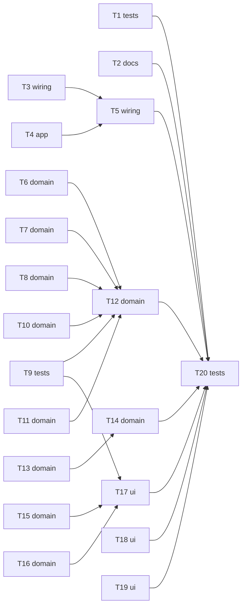

# Epic — architecture-hardening

> **Spec:** [spec.md](../spec.md) · **Design:** [sad.md](../sad.md) · **Data model:** [data-model.md](../data-model.md) (no schema change) · **ADRs:** [adr/](../adr/)

## Goal

Raise the codebase's consistency floor to match its ceiling (spec §2 Goals) via a strictly behaviour-neutral bundle: collapse the three duplicate inventory-add methods (AC-09), reshape `GameSession`/`DungeonSession`/`BattleFightViewModel` from god-objects into orchestrators over DI-injected, domain-rule-family mutators (AC-06, ADR-0002), convert the two resolvable navigation routes to ID/zero-payload with destination-side resolution (AC-05/AC-07, ADR-0003), route all ViewModel/service logging through the logger abstraction and lock it in with a mechanical SwiftLint guard (AC-02, ADR-0004), and fix the two identified doc issues (AC-08) — all while keeping the existing test suite green (AC-01, AC-03, AC-04).

## Scope

- **In:** `Packages/elf_Kit/Sources/DataLayer/Sessions/{GameSession,DungeonSession}.swift`, new `DataLayer/Services/<Family>/` mutator triads, `Packages/elf_Kit/Sources/UILayer/BattleFight/BattleFightViewModel.swift` (+ new `+Display.swift`), `Packages/elf_iOS/Sources/Navigation/AppRoute.swift` + `RouteViews/SessionRouteView.swift` + destination screens, `.swiftlint.yml`, the two named doc fixes (`GameStore.swift`, `CLAUDE.md`).
- **Out (spec §3):** any new SPM feature-module; player-facing save-failure surfacing (E-1); the battle routes (`.battleFight`/`.autoBattleResult`/`.multiBattleResult`); `M-1` player-index rework; a repo-wide comment audit beyond the two named AC-08 items.

## Pre-existing-code correction (found during this `tasks` pass, re-verifying sad.md §5 against current code per spec ¶4's standing instruction)

Direct file inspection (2026-07-10) found **two of sad.md §5's "NEW" mutators already exist**:
- `BuffApplicationService` already has its full DI triad (`Services/BuffApplication/`) and `GameSession.applyGlobalBuffToPlayer`/`applyGlobalBuff` + `BattleFightViewModel.applyBattleBuff` already delegate to it as one-line calls. Only `rescaleCurrentVitals` (vitals rescaling, not the buff rule) stays local.
- The DUP-1 inventory-add trio already delegates to the existing injected `InventoryService` — the remaining duplication is three near-identical `map` transforms, not three independent domain-logic copies.

T9 replaces "build a new BuffApplication mutator" with "verify AC-06 is already satisfied + close any test gap"; T6 (DUP-1) is scoped as a map-collapse inside `GameSession`, not a new service triad. Flagged here so the discrepancy is visible at implement/review, not silently reconciled.

## Task map

## Tasks

See [tracker.md](./tracker.md) for status. Machine contract: [tasks.json](../tasks.json).

| # | Task | Layer | Blocked by | DoD (short) |
|---|---|---|---|---|
| T1 | Capture pre-refactor perf baseline | tests | — | `battle_simulation_IntegrationTests` duration recorded |
| T2 | Fix the two AC-08 doc issues | docs | — | stale comment removed, platform line matches `Package.swift` |
| T3 | Resolve persistence/coordinator print-site disposition | wiring | — | all 3 flagged sites have an explicit fix or allow-list entry |
| T4 | Route the 9 confirmed print sites through the logger | app | — | 0 raw `print(` left in the 4 named files |
| T5 | Add the SwiftLint logging guard + allow-list | wiring | T3, T4 | `swiftlint --strict` clean; a deliberate print is blocked |
| T6 | DUP-1: collapse the 3 inventory-add methods | domain | — | 1 core path, 3 shim signatures preserved, tests green |
| T7 | Extract `RewardApplicationMutator` + invariant #1 test | domain | — | invariant test written first, passes; facade delegates |
| T8 | Extract `RosterProgressionMutator` | domain | — | own unit test; facade delegates |
| T9 | Verify `BuffApplicationService` AC-06 compliance | tests | — | test gap closed; `rescaleCurrentVitals` disposition decided |
| T10 | Extract `DayCycleMutator` | domain | — | own unit test; facade delegates |
| T11 | Extract `DungeonLifecycleMutator` | domain | — | own unit test; facade delegates |
| T12 | Extract `WorldTurnMutator` + invariant #2 test + `GameSession` convergence | domain | T6,T7,T8,T9,T10,T11 | invariant test first; `GameSession` has no inline domain-rule mutation left |
| T13 | Extract `RunProgressionMutator` | domain | — | own unit test; facade delegates |
| T14 | Extract `RoomBattleRewardMutator` + `DungeonSession` convergence | domain | T13 | own unit test; `DungeonSession` has no inline domain-rule mutation left |
| T15 | Extract `RoundExecutionMutator` | domain | — | own unit test; VM delegates |
| T16 | Extract `DuelPairingMutator` | domain | — | own unit test; VM delegates |
| T17 | `BattleFightViewModel+Display` split + convergence | ui | T9,T15,T16 | pure display extension; VM has no inline domain-rule mutation left |
| T18 | `AppRoute.gameSession` → `GameID` + destination resolution | ui | — | hand-written equality gone; mismatch pops back silently |
| T19 | `AppRoute.calendar` → zero-payload + destination resolution | ui | — | hand-written equality gone; calendar/day resolved at destination |
| T20 | Final gate: build + test + lint + perf regression | tests | T1,T2,T5,T12,T14,T17,T18,T19 | AC-01 fully green; perf within ±5% of T1 baseline |

## Risks / Hard rules

- **AC-04 is TDD red-first, non-negotiable** (sad §11): the reward-application ordering invariant (T7) and the world-turn roster-reshuffle guard (T12) each need their named regression test written *before* the mutator extraction — a test written after would validate the new code against itself.
- **AC-06's delegation test is structural, not LOC-based**: relocating logic into more extension files of the same type does **not** satisfy any mutator task's DoD — the sad §6 NFR ≤300-LOC target is advisory only; the hard gate is a separate injected type + its own unit test + a facade reduced to one delegating call.
- **AC-03 (module-gated mutation)** must hold after every mutator extraction — session/game state stays `private(set)`, mutation only through the facade; a mutator that exposes a public setter on session state is a regression, not a refactor.
- **T5 (the SwiftLint guard) must not go in before T3/T4** — enabling `--strict` with unresolved raw-`print` sites breaks the build for everyone, not just the new code.
- **T3's persistence-layer disposition is a real open call** (sad §11 risk rows 1–2) — resolved here as: extend the allow-list for `FileGameSaveStorage.swift`/`DungeonRunRewardsSaveData.swift` (no easy DI access at their call sites, same rationale as the other allow-listed categories), and bring `AppCoordinator.swift:101` in scope (a logger dependency is already reachable there, cheap consistency win) — flagged for confirmation at `implement`/`review`, not a silent default.
