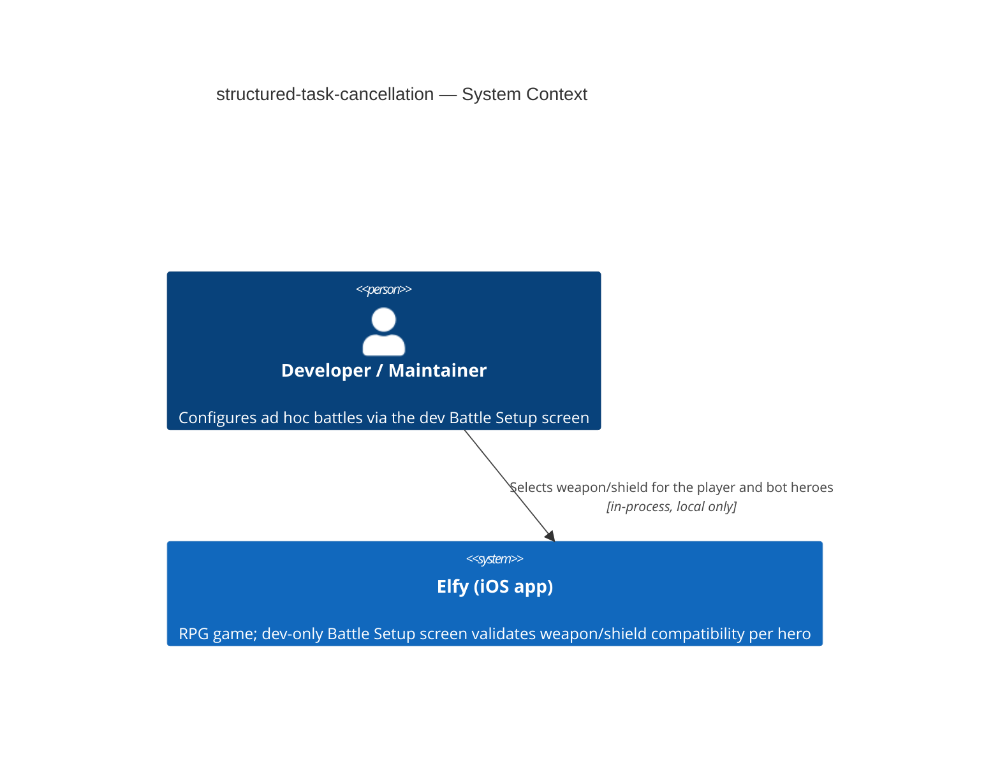
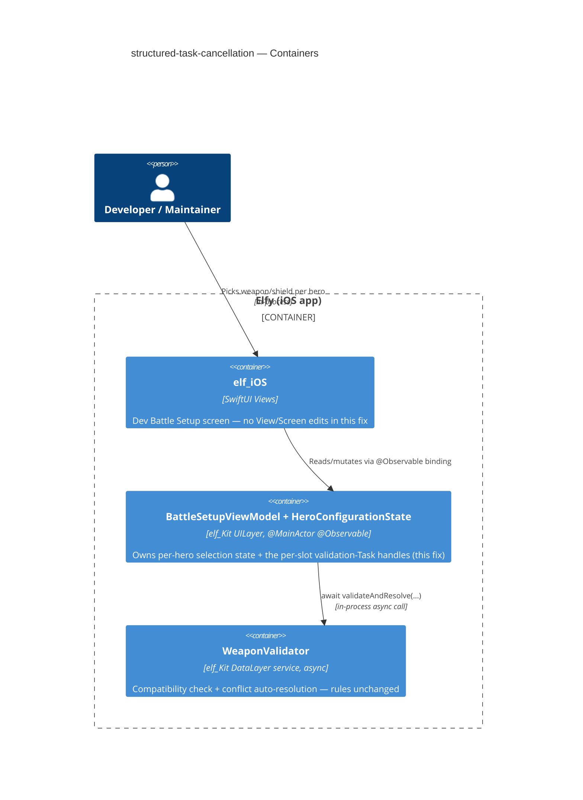
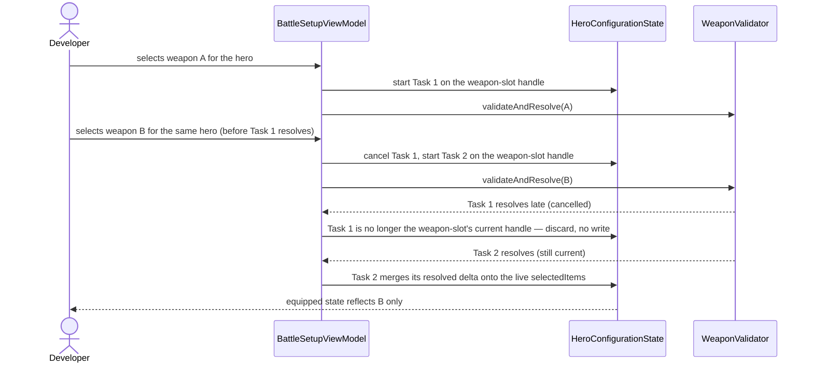
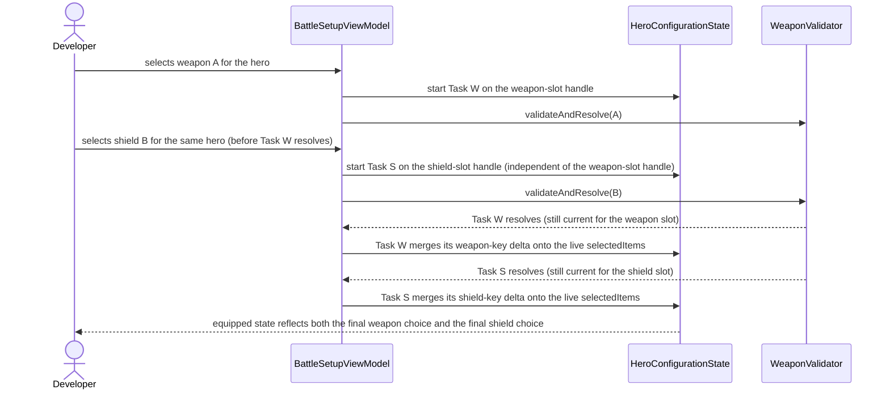
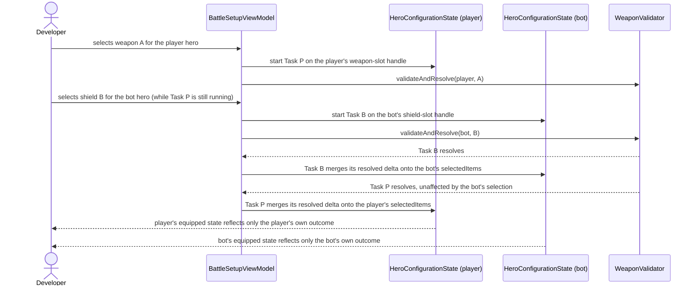
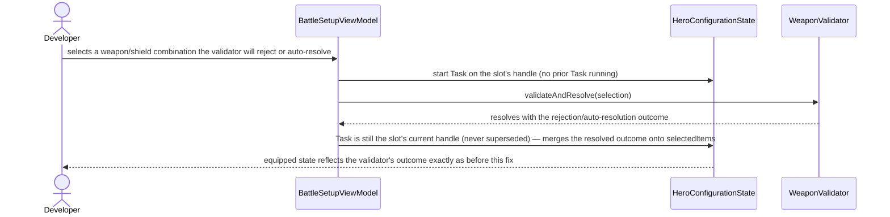

# Software Architecture Document — structured-task-cancellation

## 1. Introduction and goals

**Intent.** Elfy's dev-only Battle Setup screen (`BattleSetupViewModel`) lets the Developer / Maintainer
configure a player hero and a bot hero for ad hoc battle testing, including picking each hero's weapon
and shield. Picking a weapon or shield that needs compatibility validation runs that check inside an ad
hoc, unstored `Task { }` today, so a rapid re-selection races the previous one and either can win. This
fix stores each hero's per-slot validation `Task` as an explicit, cancel-and-replace handle, so the
equipped state always reflects the Developer's true last choice — deterministically, not by accident of
which `await` happens to resolve first.

**Top-3 quality goals (1-liners; full scenarios in §10):**

1. Correctness under concurrent re-selection — no state race, for the same slot or across slots.
2. Deterministic, provable Task lifecycle — verifiable with a controllable fake validator, not
   wall-clock timing.
3. Behavior neutrality on the already-correct path — a single, non-rapid selection is unaffected.

**Stakeholders.**

| Role | Interest | Sign-off owner? |
|---|---|---|
| Developer / Maintainer | Uses the dev Battle Setup screen for ad hoc battle testing; needs the equipped state to always match their actual last tap | No |
| Tech Lead | SAD approval | Yes |

**Decision overrides (¶4):**

- Decision override: Task-handle storage location — rationale: spec §1 ¶3 names `BattleSetupViewModel`
  as the storage location ("a property (or properties) on `BattleSetupViewModel`"). §5 places the two
  per-slot handles on `HeroConfigurationState` instead — the per-hero state object the ViewModel already
  owns, and where `selectedItems` itself already lives. This is a refinement, not a contradiction: the
  spec's own "(or properties)" qualifier leaves the exact shape open, the handles still live inside the
  object graph `BattleSetupViewModel` owns end-to-end, and this placement gives AC-05's per-hero
  independence directly from `playerState`/`botState` already being separate instances — no new
  hero-keyed dictionary on the ViewModel needed.

## 2. Constraints

**Technical.**
- Swift 6.0, full Swift 6 language mode / strict concurrency (`Packages/elf_Kit/Package.swift`)
- iOS 18+, SwiftUI — this fix is UI-inert (no View/Screen changes), but runs inside that target
- No datastore touched — in-memory, dev-only ViewModel state only, nothing persisted
- Architecture convention: MVVM — `@MainActor @Observable` ViewModels (`elf_Kit` UILayer), services
  injected via `@Dependency` (`elf_Kit` DataLayer); strict one-directional module graph
  `elf → elf_iOS → {elf_Kit, elf_SwiftUI}` — unaffected, this fix stays entirely inside `elf_Kit`

**Organisational.**
- Effort budget: 1 PR, ≤1 day (`.size` = XS, `.route` = quick)
- Deadline: none stated — solo-dev pet project, quality over speed (per project conventions)
- Team: solo (Vitalii Lytvynov)

**Conventions.**
- `.claude/docs/project-architecture.md`, `.claude/docs/threading-model.md` — no `static`, DI-only,
  async/await (never Combine)
- Naming: reuses the project's existing stored-`Task<Void, Never>?`-handle convention
  (`GameSession.saveInBackground()`'s `saveInFlight`) as a *pattern reference only* — deliberately
  **not** its coalescing policy (§4 decision 4)

**Regulatory / external.**
- N/A — dev-only internal debug tool; no PII, no network surface, no auth boundary (spec §6.1)

## 3. Context and scope

Elfy's dev-only Battle Setup screen lets the Developer / Maintainer configure two ad hoc heroes (player,
bot) for manual battle testing. Selecting a weapon or shield triggers an async compatibility check; this
fix corrects that check's `Task` lifecycle so the screen always reflects the Developer's true last
selection. There is no end-user-facing surface at all — the sole audience is the solo developer running
the app in the simulator.

<!-- brownfield: elf_Kit UILayer (BattleSetupViewModel/HeroConfigurationState) + DataLayer (WeaponValidator),
     per docs/architecture-map.md (reflects_commit 03562c3, fresh — no drift since). -->

**External systems (in / out):**

| Actor or system | Type | Interaction |
|---|---|---|
| Developer / Maintainer | Person | Picks a weapon/shield per hero on the dev Battle Setup screen |

External: none — deliberate. A dev-only debug screen with no network surface and no third-party
integration (spec §6.1).

**C4 Context (L1):**



## 4. Solution strategy

**Top strategic choices (the seeds for ADRs):**

1. **Target surface: `mobile-app` only** — Elfy is a single native iOS SwiftUI app; this fix lives
   entirely inside `elf_Kit`'s existing UILayer/DataLayer split. No second surface is introduced, so the
   multi-surface blast-radius trigger doesn't apply. No UI-architecture follow-on decision either — the
   app is already native SwiftUI (an established brownfield convention, not a fresh choice with a
   legitimate alternative to walk).
2. **Cancel-and-replace Task lifecycle, scoped per item slot** — store two `Task<Void, Never>?` handles
   per hero (one for `.weapons`, one for `.shields`) on `HeroConfigurationState`, cancelling a slot's
   previous validation `Task` before starting its replacement. A shared handle per hero was considered
   and rejected: it would let a shield selection spuriously cancel an in-flight weapon validation the
   Developer never touched. → **ADR-0001**.
3. **Merge-on-write, not full-dict overwrite** — a completing `Task`'s own resolved delta is applied
   onto the *current* `selectedItems`, not blindly assigned from its stale pre-`await` snapshot. A
   full-dict overwrite would let a slot's `Task` (started earlier, resolving later) silently revert the
   other slot's already-applied, newer selection — the AC-06 violation. → **ADR-0001** (bundled with
   decision 2 — both facets of the one Task-lifecycle model).
4. **No coalescing** — deliberately does not copy `GameSession.saveInBackground()`'s "run one more
   follow-up pass" policy (spec §1 ¶3): a superseded validation's result is worthless here, so
   cancel-and-replace is simpler and sufficient. Already fixed by the spec's own reasoning, not a fresh
   design choice — no legitimate alternative to weigh, so inline only, no ADR.

Each tactical decision in later sections traces to one of these seeds.

## 5. Building block view

MVVM, unchanged — no new module, no new type beyond two stored properties, no new DI registration.
`BattleSetupViewModel` (`@MainActor @Observable`, `elf_Kit` UILayer) delegates per-hero mutable state to
`HeroConfigurationState` (also `@MainActor @Observable`); `WeaponValidator` (`elf_Kit` DataLayer,
injected via `@Dependency`) performs the actual compatibility check — its rules are untouched (spec §3
Non-goal). This fix adds the two per-slot `Task<Void, Never>?` handles to `HeroConfigurationState` (the
same instance that already owns `selectedItems`, so AC-05's player/bot independence falls out for free —
`playerState` and `botState` are already separate instances) and changes
`BattleSetupViewModel.updateSelectedItems`'s Task-start and write-back logic.

**Internal decomposition (existing tree, touched files annotated):**

```
Packages/elf_Kit/Sources/UILayer/Dev/BattleSetup/
├── BattleSetupViewModel.swift        <touched: updateSelectedItems's Task lifecycle + write path>
├── BattleSetupDisplayModels.swift    <touched: HeroConfigurationState gains 2 Task<Void, Never>? handles>
Packages/elf_Kit/Sources/DataLayer/Validators/WeaponValidator/
└── WeaponValidator.swift             <unchanged — validateAndResolve's contract/rules are out of scope>
```

**C4 Container (L2):**



The Task-handle model and the merge-on-write mechanism are detailed in **ADR-0001**.

## 6. Runtime view

**Critical flow 1: Rapid re-selection of the same slot — cancel-and-replace**



**Critical flow 2: Cross-slot rapid selection preserves both outcomes (AC-06)**



Each slot's `Task` merges only its own key onto the live `selectedItems` (per ADR-0001's merge-on-write),
so the weapon-slot write and the shield-slot write never clobber each other regardless of completion
order.

**Critical flow 3: Cross-hero independent validation lifecycles (AC-05)**



`playerState` and `botState` are separate `HeroConfigurationState` instances, so starting, cancelling, or
completing one hero's `Task` never touches the other hero's handle or `selectedItems`.

**Critical flow 4: Single non-rapid selection with validator rejection/auto-resolution (AC-02)**



No cancellation ever triggers on this path — the fix's cancel-and-replace guard is inert for a single,
non-rapid selection, so the rejection/auto-resolution outcome is applied unchanged from today's behavior.

## 7. Deployment view

<!-- N/A: reuses the existing Elfy iOS app deployment unit (simulator / TestFlight / App Store) — a pure in-process ViewModel fix, no infra change. -->

## 8. Crosscutting concepts

| Concept | Convention | Where defined |
|---|---|---|
| Logging | None added or changed — no observability requirement for this dev-only screen | spec §6.1 |
| Authentication | N/A — no auth boundary (offline single-user game, dev-only tool) | spec §6.1 |
| Error handling | N/A — no new error type; `WeaponValidator.validateAndResolve` stays non-throwing | `WeaponValidator.swift` |
| Concurrency / Task lifecycle | Per-slot `Task<Void, Never>?` stored handles on `HeroConfigurationState`, cancel-and-replace + merge-on-write | ADR-0001 |
| Internationalisation | N/A — single language, dev-only screen | — |
| Observability | N/A — correctness is proven by the regression test (§10), not runtime telemetry | — |
| Events | N/A | — |

## 9. Architecture decisions

| # | Title | Status | Section |
|---|---|---|---|
| 0001 | Scope validation-task handles per item slot and merge writes onto live state | Accepted | §5 |

ADR files live under `docs/features/structured-task-cancellation/adr/NNNN-<title>.md`.

## 10. Quality requirements

**QG-1. Race safety (rapid re-selection)**
- **When:** ≥2 rapid re-selections (same slot, or cross-slot) for a hero before validation resolves
- **Then:** 0 out-of-order writes to that hero's equipped state
- **How verify:** new regression test exercising rapid re-selection (AC-01, AC-04), using an
  injected/controllable fake `weaponValidator` that releases its result in a chosen order — not
  wall-clock (`Task.sleep`) timing, which cannot guarantee the order deterministically

**QG-2. Behavior neutrality (single selection)**
- **When:** a single, non-rapid weapon/shield selection
- **Then:** 100% of existing unit tests pass, unchanged
- **How verify:** `xcodebuild test -scheme elf_Kit -destination 'platform=iOS Simulator,name=iPhone 17'`

**QG-3. Per-hero isolation**
- **When:** both the player and bot heroes have independent, in-flight validation `Task`s
- **Then:** 0 cross-hero interference between the player's and bot's validation `Task`s
- **How verify:** new unit test (AC-05)

**QG-4. Build / lint health**
- **When:** the fix lands
- **Then:** 0 new build warnings, 0 lint violations
- **How verify:** `xcodebuild -scheme elf -destination 'platform=iOS Simulator,name=iPhone 17' build`,
  `swiftlint --quiet`

## 11. Risks and technical debt

| Risk / debt | Severity | Mitigation | Owner |
|---|---|---|---|
| A slot's validation `Task` can still apply an auto-resolved conflict (e.g. a two-handed weapon clearing a shield) based on a stale snapshot of the *other* slot, if that other slot changed concurrently during the same rapid cross-slot edit — a narrow residual case beyond AC-06's own tested scenario (ADR-0001, Consequences/Neutral) | Low | Documented as accepted debt, not solved by this fix — closing it fully would need a live re-validation loop, over-engineering for a dev-only testing screen; revisit only if this screen sees heavier use | Vitalii Lytvynov |
| Pre-existing: `updateSelectedItems`'s validated branch used to overwrite the whole `selectedItems` map from a pre-tap snapshot, which could clobber a non-validating item (e.g. boots) picked while a weapon/shield validation was in flight. Decision 3's merge-on-write (ADR-0001) incidentally narrows this — only the validator's changed key(s) are applied, not the whole map — but the path remains out of scope for this fix (spec §3 Non-goal): it is not re-tested here and no guarantee is made beyond the `.weapons`/`.shields` race this fix targets | Low | Deferred as a separate future finding (tracked in spec §3 / `nextArch/possiblePlans.md`) | — |

**Accepted debt (acceptable in v1, plan to fix later):**
- The two-handed/stale-snapshot residual case above (ADR-0001 Neutral) — acceptable for a dev-only
  testing screen; revisit if usage grows.
- `MultiBattleViewModel.runningTask` dead code and the missing `.disabled` double-tap guards on
  `BattleSetupScreen`/`AutoBattleResultScreen`/`MultiBattleResultScreen` (spec §3 Non-goals) are
  pre-existing, explicitly out of scope — tracked as separate future findings, not reintroduced here.
- No cancellation of an in-flight weapon/shield-validation `Task` when the Battle Setup screen is
  dismissed (spec §3 Non-goal) — an abandoned `Task` keeps the ViewModel alive until it completes; a
  resource cost, not an equipped-state correctness issue (nothing reads the state after dismissal),
  deferred as a separate future finding.

## 12. Glossary

| Term | Meaning |
|---|---|
| Hero's equipped state | `HeroConfigurationState.selectedItems` — the raw weapon/shield/etc. picks; not the downstream `applyEquipment`-recomputed values (armor, per-hand damage, attributes) |
| Validation Task | The `Task<Void, Never>` that runs `WeaponValidator.validateAndResolve` for a `.weapons` or `.shields` selection |
| Cancel-and-replace | Cancelling a slot's previous validation `Task` before starting a new one for the same slot, rather than coalescing them into a follow-up pass |
| Superseded Task | A validation `Task` whose slot handle has since been replaced by a newer selection for the same slot — its result, if it completes anyway, must not be written |
| Merge-on-write | Applying only the validator's actually-changed key(s) onto the current `selectedItems` at write time, instead of overwriting the whole map from a stale pre-`await` snapshot |
