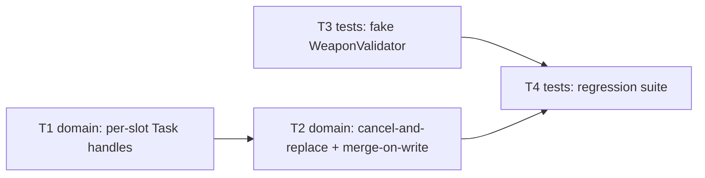

# Epic — structured-task-cancellation

> **Spec:** [spec.md](../spec.md) · **Design:** [sad.md](../sad.md) · **ADRs:** [adr/](../adr/)

## Goal

Close finding #1 (🔴 High) from `nextArch/possiblePlans.md`: `BattleSetupViewModel`'s weapon/shield
compatibility validation runs in an unstored, uncancelled `Task {}`, so a rapid re-selection races the
previous one and the equipped state can end up reflecting a stale choice instead of the Developer's
true last pick. This epic makes the Task lifecycle explicit (per-slot stored handles,
cancel-and-replace) and the write safe (merge-on-write onto live state), with zero behavior change on
the already-correct single-selection path (spec §2 Goals).

## Scope

- **In:** `elf_Kit` UILayer — `BattleSetupViewModel.updateSelectedItems`,
  `HeroConfigurationState` (2 new stored `Task<Void, Never>?` handles), plus the regression tests and
  fake validator double needed to prove the race is closed deterministically.
- **Out (spec §3):** `MultiBattleViewModel.runningTask` dead code; `.disabled` double-tap guards on
  Screens; `WeaponValidator`'s validation rules; the debounced `applyAttributes`/`applyEquipment`
  pipeline; the pre-existing non-validating-item clobber path; cancellation on screen dismissal.

## Task map

T1 and T3 have no dependencies and can start in parallel; T2 needs T1, T4 needs both T2 and T3.

## Tasks

See [tracker.md](./tracker.md) for status. Machine contract: [tasks.json](../tasks.json).

| # | Task | Layer | Blocked by | DoD (short) |
|---|---|---|---|---|
| T1 | Add per-slot validation-Task handles to `HeroConfigurationState` | domain | — | Two independent `Task<Void, Never>?` handles exist |
| T2 | Cancel-and-replace + merge-on-write in `updateSelectedItems` | domain | T1 | Superseded Tasks never write; only changed key(s) merged onto live state |
| T3 | Controllable fake `WeaponValidator` test double | tests | — | Test can force a chosen resolution order deterministically |
| T4 | Regression suite (rapid re-selection, cross-slot, cross-hero, neutrality) | tests | T2, T3 | AC-01–AC-06 covered; full `elf_Kit` suite green |

## Risks / Hard rules

- No coalescing (sad §4 decision 4) — a superseded Task's result is discarded outright, never
  re-run; do not reintroduce `GameSession.saveInBackground()`'s follow-up-pass policy here.
- Merge-on-write must diff against the validator's *input* snapshot to find changed key(s), then
  apply onto `selectedItems` *as it is at write time* — never a full-dict overwrite (ADR-0001;
  the AC-06 lost-update risk).
- Residual accepted debt (sad §11, ADR-0001 Neutral): a slot's auto-resolved conflict can still be
  decided against a stale snapshot of the *other* slot in a narrow concurrent-cross-slot-edit case —
  not solved by this epic, not re-tested beyond AC-06's own scenario.
