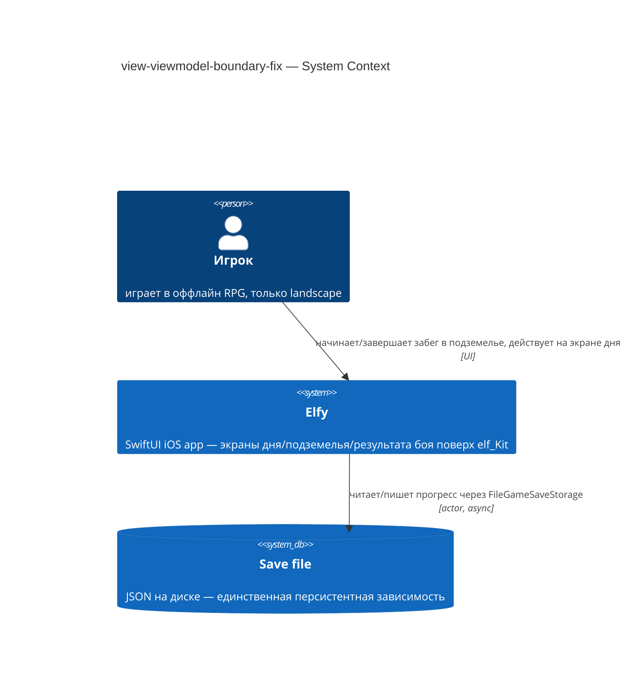
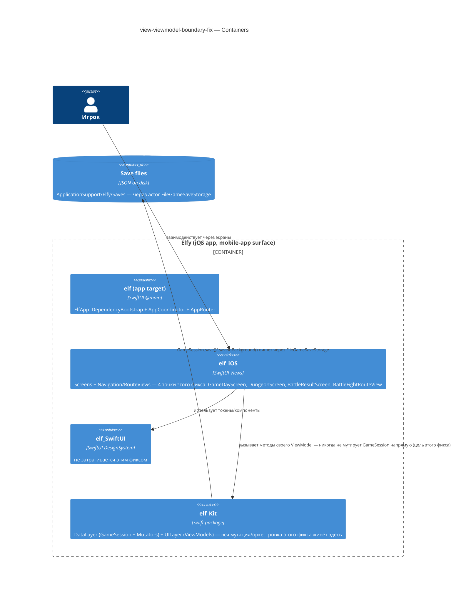
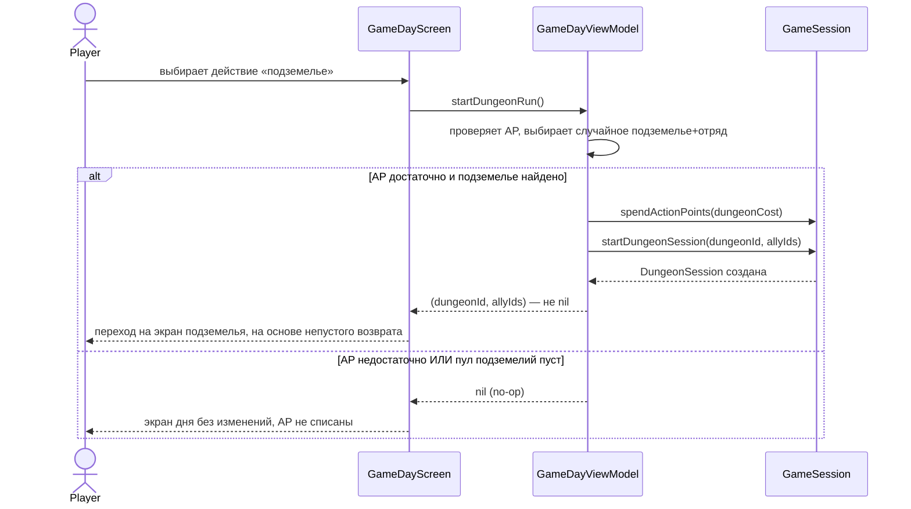
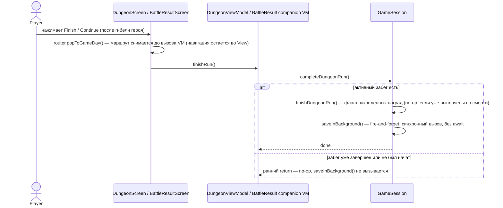
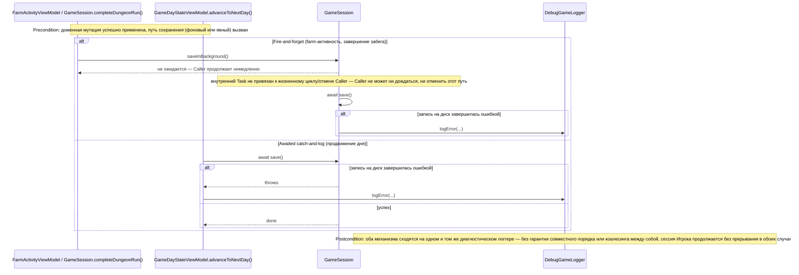
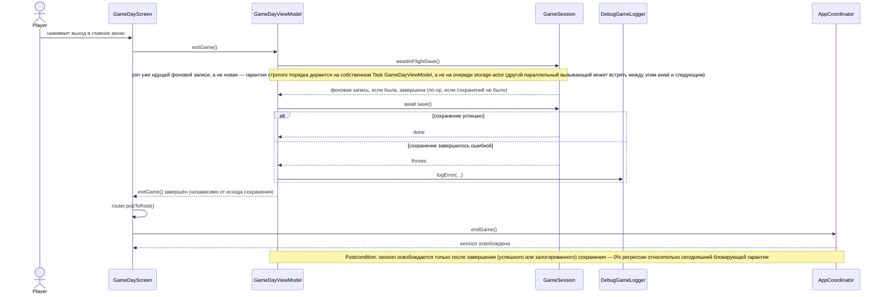
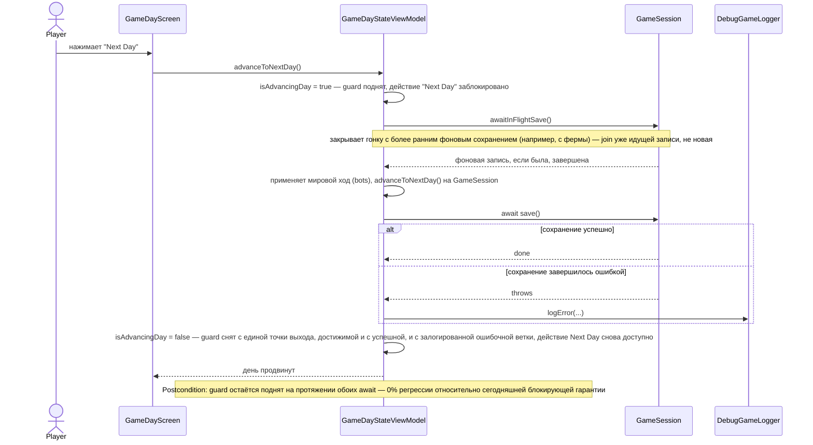

# Software Architecture Document — view-viewmodel-boundary-fix

## 1. Introduction and goals

**Intent.** Устранить два узких, но реальных нарушения MVVM-конвенции Elfy, найденных собственным архитектурным обзором (`nextArch/ARCHITECTURE_REVIEW.md`, V-2/V-3/V-4) и расширенных в ходе уточнения scope: (а) четыре места в слое View, напрямую мутирующие `GameSession`/`DungeonSession` в обход своего `@Observable` ViewModel (`GameDayScreen`, `DungeonScreen`, `BattleResultScreen`, `BattleFightRouteView`), и (б) три ViewModel, молча отбрасывающие ошибки фонового сохранения через `try? await session.save()`. Заодно фикс закрывает документированный пробел: старт забега в подземелье никогда не списывает очки действия. Работа предназначена для единственного разработчика/игрока этого pet-проекта.

**Top-3 quality goals (1-liners; full scenarios in §10):**

1. Архитектурная согласованность (conformance) — View никогда не мутирует `GameSession`/`DungeonSession` напрямую, только через свой ViewModel.
2. Целостность доменного инварианта жизненного цикла забега — очки действия списываются ровно один раз при старте, а завершение забега (Finish или гибель героя) идемпотентно и не дублирует выплату/сохранение.
3. Диагностируемость сбоев фонового сохранения — каждый путь ошибки сохранения наблюдаем через существующий логгер, а не проглатывается молча.

**Stakeholders.**

| Role | Interest | Sign-off owner? |
|---|---|---|
| Player (Игрок) | Не теряет прогресс/награды забега независимо от того, чем он закончился; видит забег как обычное стоимостное действие | No |
| Developer (Vitalii Lytvynov) | Может писать unit-тесты на новую/изменённую логику ViewModel без рендеринга View; сопровождает единственный источник правды для завершения забега | No |
| Tech Lead | SAD approval | Yes |

## 2. Constraints

**Technical.**
- Swift 6.0, полный strict concurrency mode (`swiftLanguageModes: [.v6]`)
- SwiftUI (iOS 18+), `@Observable` + `@MainActor`, `NavigationStack`, async/await (никакого Combine)
- swift-dependencies (Point-Free) 1.4.0+ — вся DI через `@Dependency`
- Архитектурная конвенция: `GameSession` — единый MainActor-фасад для мутации + персистенции; собственный doc-комментарий класса прямо фиксирует «there is no separate "service" layer underneath — the mutation logic lives directly in this type» (`GameSession.swift:11-21`). Доменные мутации делегируются injected `*Mutator`-типам (например `DungeonLifecycleMutator`), но их оркестровка и persistence-вызовы остаются на самом `GameSession`.

**Organisational.**
- Размер XS (`.size`), маршрут `quick` (`.route`) — 1 PR, ≤1 день
- Единственный разработчик (Vitalii Lytvynov), без дедлайна

**Conventions.**
- `.claude/docs/project-architecture.md` — MVVM-wiring: View ← ViewModel → GameSession/Services
- `.claude/docs/dependency-injection.md` — Builders/Validators/Calculators/Resolvers идут через `@Dependency`, не конструируются напрямую
- Запрет `static` (`CLAUDE.md` §Code Rules) — новые зависимости только через DI
- ViewModel-фабрики централизованы в `GameSession+ViewModelFactories.swift` (по одному `make*ViewModel()` на экран)

**Regulatory / external.**
- N/A — офлайн, single-player, персональные данные не затронуты (spec §6.1: Data classification Internal, AuthZ/AuthN impact None, abuse cases N/A).

## 3. Context and scope

Elfy — офлайн однопользовательская iOS RPG. Этот фикс не добавляет ничего внешне видимого игроку (кроме списания AP за забег) — это внутренняя правка границы View↔ViewModel↔GameSession и пути диагностики ошибок сохранения. Единственная внешняя зависимость системы — локальный save-файл на диске; сетевых систем и сторонних сервисов нет.

<!-- brownfield: пересканировано explorer-агентом на HEAD (04780ca) — architecture-map.md (reflects_commit 03562c3) устарела для этой зоны после коммита a036f5d (extract 11 domain mutators). Актуальная карта: GameSession — MainActor @Observable фасад, делегирующий доменные мутации injected *Mutator-типам (DungeonLifecycleMutator и др.), сам владеющий persistence (save/saveInBackground/awaitInFlightSave). -->

**External systems (in / out):**

| Actor or system | Type | Interaction |
|---|---|---|
| Player | Person | Взаимодействует через экраны дня/подземелья/результата боя, инициирует старт и завершение забега |
| Save file (JSON on disk) | System (internal, on-device) | `GameSession.save()`/`.saveInBackground()` читает/пишет через actor `FileGameSaveStorage`; единственная персистентная зависимость, без изменений в этом фиксе |
| Внешние сервисы | — | Нет (офлайн-игра, задекларировано намеренно — spec §6.1) |

**C4 Context (L1):**



## 4. Solution strategy

**Top strategic choices (the seeds for ADRs):**

1. **Target surface: `mobile-app`.** Существующий iOS-app, фикс не вводит новую поверхность и не расширяет `target_surfaces` — записано во frontmatter как констатация факта, а не новый выбор. UI-архитектура для этой поверхности (native SwiftUI, `@Observable`+`@MainActor`) уже установлена всей остальной кодовой базой и этим фиксом не пересматривается — ADR не нужен (0 из 3 критериев blast radius: не новый выбор, альтернатив не рассматривается).
2. **Единое владение завершением забега — все 4 точки нарушения проходят исключительно через фасадные методы `GameSession`, ни одна не остаётся вызовом, «не покрытым единым владением» (spec §1 ¶3).** `DungeonScreen` (кнопка Finish) и `BattleResultScreen` (продолжение после гибели героя) сегодня дублируют идентичную пару вызовов `gameSession.finishDungeonRun()` + `.saveInBackground()`. `GameSession` получает один новый метод `completeDungeonRun()`, оборачивающий эту пару с ранним return при отсутствии активного забега (для идемпотентности, AC-03/AC-04); `DungeonViewModel` (уже хранит `gameSession`) вызывает его через тонкий `finishRun()`; для `BattleResultScreen` заводится новый маленький session-aware companion-ViewModel (через новую фабрику в `GameSession+ViewModelFactories.swift`), поскольку generic `BattleResultViewModel = ResultViewModel<T>` документирован как переиспользуемый display-only тип и не должен получать session-зависимость. Четвёртая точка — `BattleFightRouteView`'s банковка наград на смерти — использует уже существующий фасадный метод `session.bankDungeonRewardsOnDeath()` (это НЕ дублированный код, как Finish/Death-continue, а единственный вызывающий сайт; общая обёртка ему не нужна) — «единое владение» здесь означает, что вызов переезжает за `BattleFightViewModel` (уже хранит `session: GameSession?`, `BattleFightViewModel.swift:29`) и больше не звучит из View напрямую; ни один из 4 сайтов после фикса не обращается к `GameSession`/`DungeonSession` в обход фасадных методов самого `GameSession`. Решение (место общей Finish-логики) задевает ≥2 модуля (`elf_Kit` UILayer, `elf_iOS` Screens), необратимо в разумном смысле (переигровка — переписывание 3+ файлов) и имеет легитимную альтернативу (отдельный DI-сервис, который независимо предложили и SwiftUI-, и Swift-concurrency-консультанты) — **→ ADR-0001**.
3. **Старт забега — расширение существующего `GameDayViewModel`, не новый тип.** Новый метод оборачивает уже существующие `prepareDungeonRun()` + `session.startDungeonSession(...)` и добавляет списание `dungeonCost` в очках действия — единственный модуль (`GameDayViewModel`), альтернатив не рассматривается (спека уже фиксирует эту форму дословно) → инлайн, без ADR.
4. **Диагностика ошибок сохранения — переиспользование существующего `DebugGameLogger`, без новой абстракции.** Четыре места `try? await session.save()` (`FarmActivityViewModel` ×2 — строки 147, 156, `GameDayStateViewModel.advanceToNextDay()`, `GameDayViewModel.exitGame()`) синхронизируются с уже established паттерном `AppCoordinator.saveOnBackground()` (awaited catch-and-log через `debugGameLogger.logError(...)` под `#if DEBUG`) — конвенция уже существует в кодовой базе, просто применяется единообразно → инлайн, без ADR.

Каждое тактическое решение в §5–§8 трассируется к одному из этих четырёх пунктов.

## 5. Building block view

Слоистая (layered) архитектура без изменений: `elf_iOS` (Screens/RouteViews) держит только UI-состояние и навигацию; `elf_Kit` UILayer (`@MainActor @Observable` ViewModels) — единственная точка входа для мутации session; `elf_Kit` DataLayer (`GameSession`, injected `*Mutator`-типы, `FileGameSaveStorage`) владеет доменной мутацией и персистенцией. Этот фикс не меняет сам слоистый стиль — он закрывает 4 точки, где `elf_iOS` обходил `elf_Kit` UILayer и напрямую доставал до DataLayer.

**Внутренняя декомпозиция (только затронутые фичей единицы):**

```
Packages/elf_Kit/Sources/
├── DataLayer/Sessions/GameSession.swift        <+ completeDungeonRun() (ADR-0001)>
├── DataLayer/Services/DungeonLifecycle/…       <без изменений — finishDungeonRun()/bankDungeonRewardsOnDeath() уже здесь>
└── UILayer/
    ├── GameDay/GameDayViewModel.swift          <+ startDungeonRun() (AP debit), exitGame() → catch-and-log + awaitInFlightSave()>
    ├── Dungeon/DungeonViewModel.swift           <+ finishRun() → gameSession.completeDungeonRun()>
    ├── BattleResult/                            <+ новый session-aware companion VM (ADR-0001), генерический BattleResultViewModel не тронут>
    ├── BattleFight/BattleFightViewModel.swift    <bankDungeonRewardsOnDeath() уходит из BattleFightRouteView за уже хранимый VM'ом session: GameSession? — точный хук (например, внутри finishBattle()) — деталь tasks>
    ├── FarmActivity/FarmActivityViewModel.swift  <try? await session.save() → session.saveInBackground()>
    ├── GameDayState/GameDayStateViewModel.swift  <advanceToNextDay() → catch-and-log + awaitInFlightSave() перед сохранением (per spec §6 NFR row 4), без изменения fire-and-forget/awaited формы>
    └── GameSession/GameSession+ViewModelFactories.swift <+ фабрика для нового companion VM>

Packages/elf_iOS/Sources/
├── Screens/GameDayScreen/GameDayScreen.swift      <session.startDungeonSession(...) → viewModel.startDungeonRun()>
├── Screens/DungeonScreen/DungeonScreen.swift       <gameSession.finishDungeonRun()+.saveInBackground() → viewModel.finishRun()>
├── Screens/BattleResultScreen/BattleResultScreen.swift <coordinator.gameSession?.finishDungeonRun()+.saveInBackground() → companion VM>
└── Navigation/RouteViews/BattleFightRouteView.swift <session.bankDungeonRewardsOnDeath()+.saveInBackground() → VM-owned path>
```

**C4 Container (L2):** один контейнер на объявленную `target_surface` (`mobile-app`) — переиспользует существующие контейнеры `architecture-map.md`, новый контейнер не вводится; вся правка внутренняя для `elf_Kit`.



## 6. Runtime view

**Critical flow 1: Старт забега в подземелье (AC-01/AC-02/AC-02b)**



**Critical flow 2: Завершение забега — общий путь для Finish и гибели героя (AC-03/AC-04)**



**Critical flow 3: Банковка наград при гибели героя (AC-04, 4-я точка нарушения границы)**

```mermaid
sequenceDiagram
    participant BattleFightRouteView
    participant Launcher as onBattleConcluded (concludeRoomBattle / concludeHuntBattle)
    participant BattleFightViewModel
    participant GameSession

    Note over BattleFightViewModel: Precondition: раунд боя разрешился (battleEnded), исход боя известен
    BattleFightRouteView->>BattleFightViewModel: finishBattle()
    BattleFightViewModel->>BattleFightViewModel: determineBattleOutcome()
    BattleFightViewModel->>Launcher: onBattleConcluded(outcome, leftTeam)
    Note over Launcher: launcher владеет всей пост-боевой обработкой — concludeRoomBattle добавляет награду только что зачищенной комнаты в pendingRewards ДО того, как сработает банковка на смерти; launcher должен отработать раньше банковки, иначе награда роковой комнаты не успевает во flush
    Launcher-->>BattleFightViewModel: result (nil для dev BattleSetup-потока, session == nil)
    alt session != nil И герой повержен (heroIsDowned)
        BattleFightViewModel->>GameSession: bankDungeonRewardsOnDeath()
        GameSession-->>BattleFightViewModel: накопленные (включая только что зафлашенную launcher'ом) награды зафиксированы в player state
    else герой выжил, ИЛИ session == nil (dev BattleSetup)
        Note over BattleFightViewModel: банковка на смерти пропускается
    end
    alt session != nil И session.dungeonSession != nil
        BattleFightViewModel->>GameSession: saveInBackground()
        Note over GameSession: fire-and-forget — спонтанный Task наследует MainActor-изоляцию вызывающего контекста, но его жизненный цикл не привязан к BattleFightViewModel, и не ожидается перед переходом к результату боя. Скоуп на dungeonSession != nil: hunt-путь уже сохраняет внутри GameSession.concludeHuntBattle(), безусловный вызов здесь дал бы лишний дублирующий сейв
    end
    BattleFightViewModel-->>BattleFightRouteView: battleResult = result (присваивается всегда, даже при session == nil)
    Note over BattleFightViewModel: Postcondition: при гибели героя награды уже зафиксированы в player state до перехода на экран результата — последующий Continue (Flow 2) лишь освобождает забег через completeDungeonRun(), повторной банковки не происходит
```

**Critical flow 4: Диагностика ошибок фонового сохранения (AC-05)**



**Critical flow 5: exitGame() — упорядоченное сохранение при выходе (AC-06/AC-06b)**



**Critical flow 6: advanceToNextDay() — упорядоченное сохранение при продвижении дня (AC-06/AC-06b)**



**Flow coverage note:** US-05/AC-07 (тестируемость доменной логики напрямую, без рендеринга View) не отражена отдельным flow — это свойство самого кода (вызываемый напрямую метод ViewModel/хелпер), а не runtime-обмен сообщениями между участниками, поэтому вне формата sequence-диаграммы; проверяется unit-тестами на каждый новый/изменённый метод (см. §10 QG-2).

**Flagged for `design`:** Flow 4 вводит участника `DebugGameLogger`, который явно назван в §4 (пункт 4) и §8 (Crosscutting concepts), но не перечислен как самостоятельный building-block в файловой декомпозиции §5 — он уже существует в кодовой базе (`ConsoleDebugGameLogger`) и этим фиксом не создаётся; флаг чисто для полноты §5, не блокирует.

## 7. Deployment view

<!-- N/A: XS-фикс переиспользует существующий деплоймент-юнит (единственный iOS app target), инфраструктура не меняется. -->

## 8. Crosscutting concepts

| Concept | Convention | Where defined |
|---|---|---|
| Logging (диагностика ошибок сохранения) | Каждый прошваченный `try? await session.save()` (FarmActivityViewModel ×2, GameDayStateViewModel.advanceToNextDay(), GameDayViewModel.exitGame()) заменяется на путь, логирующий через уже существующий `DebugGameLogger`/`ConsoleDebugGameLogger` (`#if DEBUG`-gated) — новая абстракция не вводится | `.claude/docs/persistence-patterns.md`; образец — `AppCoordinator.saveOnBackground()` |
| Sync-completion-with-fire-and-forget (именованный паттерн этого фикса) | Синхронный (не `async`) метод завершения, содержащий внутри fire-and-forget `saveInBackground()`, никогда не `await`-ит между порядко-критичными шагами (снятие маршрута → освобождение session) — гарантия «pop до релиза session» проверяема компилятором (Swift 6 strict concurrency), а не только конвенцией | Новый в этом фиксе; кандидат на добавление в `.claude/docs/threading-model.md` как переиспользуемый паттерн |
| Blocking-guard save (документированное исключение из fire-and-forget) | `advanceToNextDay()` и `exitGame()` — оба сохраняют явный awaited catch-and-log (не переходят на `saveInBackground()`), т.к. блокируют защищающий флаг/вызывающую сторону до записи; **оба** дополнительно зовут `awaitInFlightSave()` перед своим сохранением (по аналогии с `AppCoordinator.saveOnBackground()`) — `advanceToNextDay()` по spec §6 NFR row 4 (закрывает гонку с более ранним фоновым сохранением, например с фермы), `exitGame()` по spec §1 ¶3 | spec §1 ¶3 + §6 NFR row 4; образец — `AppCoordinator.saveOnBackground()` |
| Authentication | N/A — офлайн, single-player, нет multi-user/multi-tenant границы | spec §6.1 |
| Error handling | Доменные ошибки — `Error, LocalizedError` enum с `errorDescription` на каждый case (без изменений в этом фиксе) | `.claude/docs/project-architecture.md` |
| ID strategy | N/A — новых сущностей/ID в этом фиксе нет | — |
| Internationalisation | N/A, единственный язык | — |
| Events | N/A, module-specific patterns этим фиксом не затронуты | — |

## 9. Architecture decisions

| # | Title | Status | Section |
|---|---|---|---|
| 0001 | Host dungeon-run completion logic directly on GameSession | Accepted | §4 |

ADR files live under `docs/features/view-viewmodel-boundary-fix/adr/0001-host-dungeon-completion-on-game-session.md`.

## 10. Quality requirements

**QG-1. Архитектурная согласованность (View→ViewModel boundary conformance)**
- **When:** любая из 4 точек нарушения (`GameDayScreen`, `DungeonScreen`, `BattleResultScreen`, `BattleFightRouteView`) исполняется после фикса.
- **Then:** 0 мест в слое View, мутирующих `GameSession`/`DungeonSession` напрямую (baseline 5 вызовов → target 0, per spec §7 KPI), исключая `#Preview`-блоки (V-7, вне scope).
- **How verify:** поиск по коду / ревью при merge PR (per spec §6 NFR row 1, дословно).

**QG-2. Целостность доменного инварианта жизненного цикла забега**
- **When:** Игрок стартует забег с недостаточным/достаточным AP (AC-01/AC-02/AC-02b), либо триггерит завершение забега дважды (Finish, затем повторно, или гибель героя → Continue дважды) (AC-03/AC-04).
- **Then:** AP списываются ровно один раз при успешном старте и никогда — при отказе; повторный триггер завершения для уже завершённого/не начатого забега — no-op без повторной выплаты наград и без повторного сохранения.
- **How verify:** unit-тесты на `GameDayViewModel`'s новый start-метод и на ранний return `GameSession.completeDungeonRun()` (`xcodebuild test -scheme elf_Kit`, per spec §6 NFR row «Покрытие новых/изменённых unit-тестов»).

**QG-3. Диагностируемость сбоев фонового сохранения**
- **When:** любой из путей сохранения (завершение забега, farm-активность, `advanceToNextDay()`, `exitGame()`) завершается ошибкой.
- **Then:** 100% проверенных мест вызова сохранения проходят через путь, логирующий ошибку через один и тот же диагностический логгер, независимо от механизма записи (fire-and-forget vs awaited catch-and-log) (per spec §6 NFR row 2, дословно).
- **How verify:** код-ревью + unit-тест, проверяющий логируемый путь (per spec §6 NFR row 2, дословно).

**QG-4. Надёжность порядка и блокировки UI при сохранении на выходе и при продвижении дня**
- **When:** Игрок выбирает выйти в главное меню (`exitGame()`) или перейти к следующему дню (`advanceToNextDay()`), пока предшествующее фоновое сохранение ещё может быть в процессе (например, только что запущенное с фермы).
- **Then:** сохранение сначала дожидается любого фонового сохранения в процессе (`awaitInFlightSave()`), затем завершается (или явно перехватывается и логируется) — прежде, чем `AppCoordinator.endGame()` освободит session (exitGame) или действие Next Day снова станет доступным (advanceToNextDay); действие Next Day остаётся заблокированным на всё время своего сохранения — 0% регрессии относительно сегодняшней блокирующей гарантии в обоих случаях (per spec §6 NFR rows 3–5, дословно).
- **How verify:** unit/integration-тест на порядок в `exitGame()`; unit/integration-тест на порядок в `advanceToNextDay()`; unit-тест, проверяющий, что guard покрывает сохранение (per spec §6 NFR rows 3–5, дословно).

## 11. Risks and technical debt

| Risk / debt | Severity | Mitigation | Owner |
|---|---|---|---|
| `GameSession.startDungeonSession(...)` не защищена от старта второго забега, пока один уже активен — молча перезаписывает `dungeonSession` (потеря наград/состояния), а теперь потенциально и двойное списание AP, если это когда-либо станет достижимым | Medium | Вне scope этого фикса; зафиксировано как открытый вопрос спеки | Vitalii Lytvynov |
| `ConsoleDebugGameLogger` компилирует тело логирования под `#if DEBUG` — гарантия «логировать вместо тихого отбрасывания», которую добавляет этот фикс, не наблюдаема в Release/TestFlight-сборках | Medium | Отдельная задача logging-инфраструктуры, до первой публичной сборки (pre-ship checkpoint per `CLAUDE.md` §Save/Persistence Policy) | Vitalii Lytvynov |
| Ещё не завершившееся `saveInBackground()` может пережить `AppCoordinator.endGame()` и столкнуться с новой игрой на том же save-слоте — существующее поведение, не вносимое этим фиксом, но через `saveInBackground()` теперь проходит больше мест вызова | Medium | Вне scope, зафиксировано как открытый вопрос; следующий проход по укреплению архитектуры | Vitalii Lytvynov |
| Ветка `feature/structured-task-cancellation` (текущая рабочая ветка) может сделать `Task.isCancelled` в `FarmActivityViewModel.performActivity()` реально достижимым в продакшене — замена `try? await session.save()` на `session.saveInBackground()` в этом пути пока не проверена на практике при реальной отмене задачи | Low | Перепроверить это место при мёрже `feature/structured-task-cancellation` | Vitalii Lytvynov |

**Accepted debt (acceptable for this fix, plan to fix later):**
- Автоматическое lint/static-правило для предотвращения будущих регрессий View→ViewModel-границы или паттерна `try? await session.save()` — не запрашивается в этом проходе; фикс вместо этого документирует паттерн как anti-pattern в `.claude/docs/common-mistakes.md` (per spec §1/§6.5 обзора).
- Видимая обратная связь Игроку при отказе старта забега из-за нехватки AP — остаётся тихим no-op, как и сегодня; отдельный продуктовый пробел, не техническая архитектура.

## 12. Glossary

| Term | Meaning |
|---|---|
| Player (Игрок) | Человек, играющий в Elfy, действующий через экраны приложения на своей локальной игровой сессии. NOT Developer. |
| Developer | Автор и сопровождающий код Elfy (сейчас единственный). NOT Player. |
| `GameSession` | `@MainActor @Observable`-фасад активной игровой сессии: владеет состоянием (`GameStore`), дочерней `DungeonSession`, каждой доменной мутацией и персистенцией. Единая точка входа для View/ViewModel — «no separate service layer underneath». |
| `DungeonSession` | Дочерняя сессия одного забега в подземелье (комнаты, отряд, накопленные награды); владеется `GameSession.dungeonSession`. |
| Завершение забега (dungeon-run completion) | Единая логика (`GameSession.completeDungeonRun()`, ADR-0001), запускаемая и по кнопке Finish, и на пути гибели героя: флашит накопленные награды (если ещё не выплачены) и запускает фоновое сохранение; идемпотентна для уже завершённого/не начатого забега. |
| `saveInBackground()` | Существующий fire-and-forget helper на `GameSession`, коалесцирующий параллельные запросы сохранения в один Task; ошибки перехватываются и логируются под `#if DEBUG`. |
| Единая логика финиша (unified Finish ownership) | Требование NFR §6 spec.md: путь кнопки Finish и путь гибели героя обязаны вызывать одну и ту же реализацию завершения — без дублирующегося кода выплаты+сохранения. |
