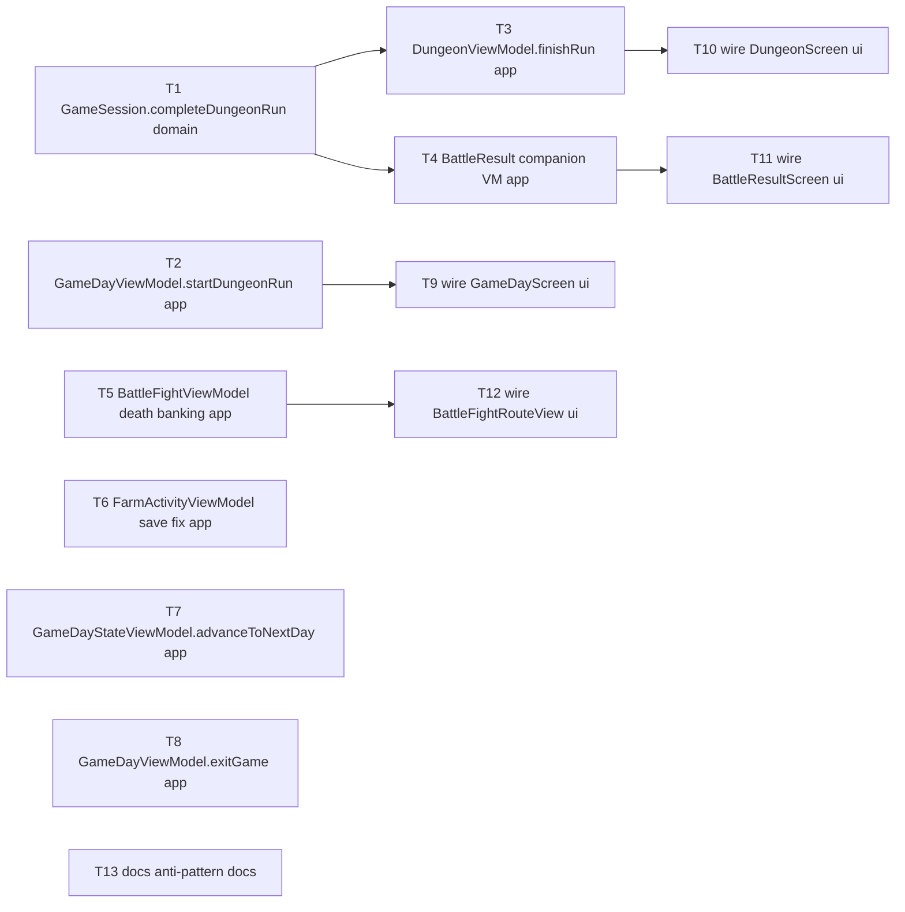

# Epic — view-viewmodel-boundary-fix

> **Spec:** [spec.md](../spec.md) · **Design:** [sad.md](../sad.md) · **ADRs:** [adr/](../adr/)

## Goal

Устранить 4 места прямой мутации `GameSession`/`DungeonSession` из View (в обход `@Observable` ViewModel), убрать 4 молча отброшенных `try? await session.save()`, и закрыть пробел «AP не списываются при старте забега в подземелье» — per spec §2 Goals.

## Scope

- **In:** `elf_Kit` UILayer (`GameDayViewModel`, `DungeonViewModel`, новый BattleResult companion VM, `BattleFightViewModel`, `FarmActivityViewModel`, `GameDayStateViewModel`), `elf_Kit` DataLayer (`GameSession.completeDungeonRun()`), `elf_iOS` (`GameDayScreen`, `DungeonScreen`, `BattleResultScreen`, `BattleFightRouteView`), `.claude/docs/common-mistakes.md`.
- **Out:** V-5/V-6/V-7 (архитектурный обзор принимает их как компромиссы вне scope, spec §3), миграция существующих XCTest-файлов на Swift Testing (V-8), защита `startDungeonSession(...)` от двойного старта, UX-обратная связь при нехватке AP, автоматическое lint-правило, включение диагностики сохранения в Release-сборках — все зафиксированы как open questions в spec §8.

## Task map

Note: T2 and T8 both touch `GameDayViewModel.swift` — serialized into the same lane by `implement` (overlapping `files_hint`), independent of this DAG's dep arrows.

## Tasks

See [tracker.md](./tracker.md) for status. Machine contract: [tasks.json](../tasks.json).

| # | Task | Layer | Blocked by | DoD (short) |
|---|---|---|---|---|
| T1 | Add `GameSession.completeDungeonRun()` with idempotent early return | domain | — | Unit test: active run finishes+saves; no active run is a no-op |
| T2 | Add `GameDayViewModel.startDungeonRun()` with AP debit | app | — | Unit tests: happy path debits once; insufficient AP / empty pool no-op |
| T3 | Route `DungeonViewModel.finishRun()` through `completeDungeonRun()` | app | T1 | Unit test: delegates, no duplicated logic |
| T4 | BattleResult companion VM + factory calling `completeDungeonRun()` | app | T1 | Unit test: delegates; generic `ResultViewModel<T>` untouched |
| T5 | Move death-path reward banking into `BattleFightViewModel` | app | — | Unit test: banks+saves on death, skips banking on survival |
| T6 | `FarmActivityViewModel`: `try?` → `saveInBackground()` | app | — | Unit test: both call sites log on failure |
| T7 | `GameDayStateViewModel.advanceToNextDay()` order + logging | app | — | Unit tests: `awaitInFlightSave()` first; catch-and-log; guard covers both awaits |
| T8 | `GameDayViewModel.exitGame()` order + logging | app | — | Unit tests: `awaitInFlightSave()` first; catch-and-log; completes either way |
| T9 | Wire `GameDayScreen` → `viewModel.startDungeonRun()` | ui | T2 | No direct session mutation left in file |
| T10 | Wire `DungeonScreen` → `viewModel.finishRun()` | ui | T3 | pop-before-call order preserved |
| T11 | Wire `BattleResultScreen` → companion VM | ui | T4 | No direct session mutation left in file |
| T12 | Wire `BattleFightRouteView` off direct `bankDungeonRewardsOnDeath()` | ui | T5 | No direct session mutation left in file |
| T13 | Document the anti-pattern in `common-mistakes.md` | docs | — | Named entry + correct-pattern example |

## Risks / Hard rules

- Sync-completion-with-fire-and-forget pattern (sad §8): the finish/exit methods that wrap `saveInBackground()` must stay synchronous (non-`async`) so route-pop-before-session-release ordering stays compiler-checked (T3, T10 in particular).
- `advanceToNextDay()` and `exitGame()` keep their **awaited** catch-and-log form — do not convert them to `saveInBackground()` (T7, T8); this is a documented exception, not an oversight.
- ADR-0001: dungeon-run completion logic is hosted on `GameSession` itself, not a new DI service (T1) — do not introduce a `DungeonRunCompleter`-style service.
